# 🏗️ ILoveYou Web Interface - Comprehensive Architectural Plan

## 📋 Executive Summary

This plan outlines the architecture for creating a web version of the "ILoveYou" React Native couples app using a separate React.js application with shared backend services. The solution will maintain full feature parity, preserve the romantic design theme, and ensure seamless integration with the existing Firebase backend.

## 🎯 Project Overview

### Current State Analysis
- **Existing App**: React Native (0.79.3) with Expo (53.0.11)
- **Backend**: Firebase (Auth, Firestore, Notifications)
- **Features**: Love Days Counter, Notes System, Reminders, Couple Connection, User Profiles
- **Localization**: Vietnamese primary, English secondary (i18next)
- **Design**: Romantic pink/magenta theme with love-themed UI components
- **Navigation**: 5-tab bottom navigation architecture

### Web Version Goals
- **Platform**: Separate React.js web application with shared services
- **Technology**: Vite + React 18 + Material-UI
- **Feature Parity**: All mobile features adapted for web
- **Responsive Design**: Desktop, tablet, and mobile web support
- **Backend Sharing**: Same Firebase services and data models

---

## 🏗️ Recommended Architecture

### 1. Project Structure Strategy


**Recommended Project Structure:**
```
ILoveYou/
├── mobile/                     # Existing React Native app (renamed)
│   ├── src/
│   ├── package.json
│   └── ...existing files...
├── web/                        # New React.js web app
│   ├── src/
│   │   ├── components/
│   │   ├── pages/
│   │   ├── layouts/
│   │   ├── hooks/
│   │   ├── contexts/
│   │   └── theme/
│   ├── public/
│   ├── package.json
│   ├── vite.config.js
│   └── index.html
├── shared/                     # Shared code between mobile and web
│   ├── services/
│   │   ├── firebase/
│   │   └── notifications/
│   ├── models/
│   ├── constants/
│   ├── utils/
│   ├── i18n/
│   └── types/                  # TypeScript definitions (optional)
├── package.json                # Root package.json for workspace
└── README.md
```

### 2. Technology Stack

#### Core Web Technologies
- **Framework**: Vite 5+ + React 18
- **UI Library**: Material-UI (MUI) v5+ with custom theme
- **Routing**: React Router Dom v6
- **State Management**: React Context + useReducer (matches mobile approach)
- **Styling**: MUI emotion-based styling with custom theme
- **Build Tool**: Vite for fast development and optimized production builds

#### Shared Dependencies
- **Backend**: Firebase v11.9.0 (same as mobile)
- **Internationalization**: react-i18next (shared with mobile)
- **Date Handling**: date-fns (for web) + existing dateUtils
- **Authentication**: Firebase Auth (shared service)
- **Database**: Firestore (shared service)

#### Development Tools
- **Package Manager**: npm workspaces
- **Linting**: ESLint + Prettier (consistent with mobile)
- **Testing**: Vitest + React Testing Library
- **TypeScript**: Optional, but recommended for better type safety

### 3. Code Sharing Strategy

#### Shared Services (100% reusable)
```javascript
// Shared services that work identically on both platforms
shared/
├── services/
│   ├── firebase/
│   │   ├── auth.js          ✅ Direct reuse
│   │   ├── firestore.js     ✅ Direct reuse  
│   │   ├── couples.js       ✅ Direct reuse
│   │   ├── notes.js         ✅ Direct reuse
│   │   ├── reminders.js     ✅ Direct reuse
│   │   └── loveDays.js      ✅ Direct reuse
│   └── notifications/
│       ├── index.js         🔄 Platform-specific implementations
│       └── reminderJob.js   🔄 Web worker vs background task
```

#### Shared Models & Constants (100% reusable)
```javascript
shared/
├── models/
│   ├── Note.js              ✅ Direct reuse
│   ├── Reminder.js          ✅ Direct reuse
│   └── User.js              ✅ Direct reuse
├── constants/
│   ├── notes.js             ✅ Direct reuse
│   ├── reminders.js         ✅ Direct reuse
│   └── colors.js            ✅ Direct reuse (for MUI theme)
├── utils/
│   ├── dateUtils.js         ✅ Direct reuse
│   └── validation.js        ✅ Direct reuse
└── i18n/
    ├── locales/
    │   ├── vi.json          ✅ Direct reuse
    │   └── en.json          ✅ Direct reuse
    └── index.js             🔄 Platform-specific i18n setup
```

#### Platform-Specific Components (Requires adaptation)
```javascript
// Mobile components -> Web components mapping
Mobile                          Web (MUI equivalent)
├── LoveButton.js           ->  ├── LoveButton.jsx (MUI Button + custom styling)
├── LoveInput.js            ->  ├── LoveInput.jsx (MUI TextField + validation)
├── LoveBackground.js       ->  ├── LoveBackground.jsx (MUI Box + gradient)
├── LoveDaysCounter.js      ->  ├── LoveDaysCounter.jsx (MUI Card + animations)
├── UserProfileCard.js      ->  ├── UserProfileCard.jsx (MUI Card + Avatar)
└── LoadingIndicator.js     ->  └── LoadingIndicator.jsx (MUI CircularProgress)
```

---

## 🎨 UI/UX Adaptation Strategy

### 1. Design System Migration

#### Color Palette (Direct port from mobile)
```javascript
// shared/constants/colors.js
export const loveTheme = {
  primary: {
    main: '#E91E63',      // Primary pink
    light: '#F8BBD9',     // Light pink
    dark: '#AD1457',      // Dark pink
  },
  secondary: {
    main: '#FFB6C1',      // Secondary light pink
    light: '#FFF0F5',     // Background
    dark: '#C2185B',      // Accent
  },
  error: {
    main: '#F44336',      // Danger red
  },
  background: {
    default: '#FFF0F5',   // Lavender blush
    paper: '#FFFFFF',
  }
};
```

#### MUI Theme Configuration
```javascript
// web/src/theme/loveTheme.js
import { createTheme } from '@mui/material/styles';
import { loveTheme } from '../../../shared/constants/colors';

export const muiLoveTheme = createTheme({
  palette: loveTheme,
  typography: {
    fontFamily: '"Inter", "Roboto", "Helvetica", "Arial", sans-serif',
    h1: {
      fontWeight: 700,
      letterSpacing: '-0.02em',
    },
  },
  shape: {
    borderRadius: 16, // Matches mobile design
  },
  components: {
    MuiButton: {
      styleOverrides: {
        root: {
          borderRadius: 16,
          textTransform: 'none',
          fontWeight: 600,
        },
      },
    },
  },
});
```

### 2. Responsive Layout Strategy

#### Breakpoint Strategy
```javascript
// Web layout adapts based on screen size
const breakpoints = {
  mobile: '0px',      // Mobile web (320px+)
  tablet: '768px',    // Tablet (768px+)  
  desktop: '1024px',  // Desktop (1024px+)
  wide: '1440px',     // Wide screens (1440px+)
};

// Layout behavior
Mobile Web:    Single column, bottom navigation
Tablet:        Two columns, side navigation  
Desktop:       Three columns, sidebar navigation
Wide Screen:   Three columns with wider content area
```

#### Navigation Architecture Adaptation

```mermaid
graph LR
    A[Mobile: Bottom Tabs] --> B[Tablet: Side Drawer]
    A --> C[Desktop: Persistent Sidebar]
    
    B --> D[Navigation Items]
    C --> D
    
    D --> E[Home 🏠]
    D --> F[Couple 💕]
    D --> G[Notes 📝]
    D --> H[Reminders ⏰]
    D --> I[Profile 👤]
```


### 3. Component Adaptation Examples

#### LoveButton Migration
```jsx
// web/src/components/ui/LoveButton.jsx
import { Button, CircularProgress } from '@mui/material';
import { styled } from '@mui/material/styles';

const StyledLoveButton = styled(Button)(({ theme, variant }) => ({
  background: variant === 'primary' 
    ? `linear-gradient(135deg, ${theme.palette.primary.main}, ${theme.palette.primary.dark})`
    : 'transparent',
  borderRadius: 16,
  minHeight: 50,
  '&:hover': {
    background: variant === 'primary'
      ? `linear-gradient(135deg, ${theme.palette.primary.dark}, ${theme.palette.primary.main})`
      : theme.palette.action.hover,
  },
}));
```

---

## 🌐 Navigation Architecture

### Web Navigation Strategy

#### Desktop Navigation (Sidebar)
```jsx
// web/src/layouts/DesktopLayout.jsx
const DesktopLayout = () => (
  <Box sx={{ display: 'flex', minHeight: '100vh' }}>
    <Drawer variant="permanent" sx={{ width: 280 }}>
      <LoveSidebar />
    </Drawer>
    <Box component="main" sx={{ flexGrow: 1, p: 3 }}>
      <Outlet />
    </Box>
  </Box>
);
```

#### Mobile Web Navigation (Bottom Navigation)
```jsx
// web/src/layouts/MobileLayout.jsx
const MobileLayout = () => (
  <Box sx={{ display: 'flex', flexDirection: 'column', minHeight: '100vh' }}>
    <Box component="main" sx={{ flexGrow: 1, pb: 8 }}>
      <Outlet />
    </Box>
    <BottomNavigation sx={{ position: 'fixed', bottom: 0, left: 0, right: 0 }}>
      <LoveBottomTabs />
    </BottomNavigation>
  </Box>
);
```

#### Route Structure
```javascript
// web/src/App.jsx
const routes = [
  { path: '/', element: <HomePage /> },
  { path: '/couple', element: <CoupleConnectionPage /> },
  { path: '/notes', element: <NotesPage /> },
  { path: '/notes/create', element: <CreateNotePage /> },
  { path: '/notes/:id', element: <NoteDetailPage /> },
  { path: '/reminders', element: <RemindersPage /> },
  { path: '/reminders/create', element: <CreateReminderPage /> },
  { path: '/profile', element: <ProfilePage /> },
  { path: '/settings', element: <SettingsPage /> },
  { path: '/login', element: <LoginPage /> },
  { path: '/signup', element: <SignUpPage /> },
];
```

---

## 🔥 Firebase Integration Strategy

### 1. Shared Service Architecture

The web version will use identical Firebase services with minimal platform-specific adaptations:

```javascript
// Shared Firebase services work identically
import { auth, db } from '../../../shared/services/firebase/config';
import { notesService } from '../../../shared/services/firebase/notes';
import { remindersService } from '../../../shared/services/firebase/reminders';
```

### 2. Web-Specific Adaptations

#### Notification Service
```javascript
// web/src/services/notifications/webNotifications.js
class WebNotificationService {
  async requestPermission() {
    if ('Notification' in window) {
      return await Notification.requestPermission();
    }
    return 'denied';
  }
  
  async scheduleReminder(reminder) {
    // Use Service Worker for background notifications
    if ('serviceWorker' in navigator) {
      const registration = await navigator.serviceWorker.ready;
      registration.showNotification(reminder.title, {
        body: reminder.description,
        icon: '/love-icon.png',
        badge: '/love-badge.png',
        tag: reminder.id,
      });
    }
  }
}
```

#### Firebase Config Sharing
```javascript
// shared/services/firebase/config.js (updated for web)
// This file works for both React Native and Web
export const isWebPlatform = typeof window !== 'undefined';
export const isMobilePlatform = !isWebPlatform;

// Platform-specific optimizations
if (isWebPlatform) {
  // Web-specific Firebase optimizations
  import('firebase/app-check').then(({ initializeAppCheck, ReCaptchaV3Provider }) => {
    initializeAppCheck(app, {
      provider: new ReCaptchaV3Provider('your-recaptcha-site-key'),
      isTokenAutoRefreshEnabled: true,
    });
  });
}
```

---

## 📱 Implementation Roadmap

### Phase 1: Foundation Setup (Week 1-2)


**Tasks:**
1. **Project Restructure**
   - Move existing React Native app to `mobile/` directory
   - Create `web/` and `shared/` directories
   - Set up npm workspaces in root `package.json`

2. **Shared Services Migration**
   - Move Firebase services to `shared/services/`
   - Move models and constants to `shared/`
   - Move i18n files to `shared/i18n/`
   - Update import paths in mobile app

3. **Web App Foundation**
   - Initialize Vite + React 18 project in `web/`
   - Install and configure Material-UI
   - Set up project structure and routing
   - Configure build and development scripts

### Phase 2: Authentication & Core Layout (Week 3-4)


**Tasks:**
1. **Authentication System**
   - Create `LoginPage.jsx` with MUI components
   - Create `SignUpPage.jsx` with validation
   - Implement `AuthContext.jsx` using shared Firebase auth
   - Add protected route logic

2. **Responsive Layout System**
   - Create `DesktopLayout.jsx` with persistent sidebar
   - Create `MobileLayout.jsx` with bottom navigation
   - Create `TabletLayout.jsx` with collapsible drawer
   - Implement responsive breakpoint logic

### Phase 3: Core Features Implementation (Week 5-8)


**Tasks:**
1. **Home & Love Days Counter**
   - Create `HomePage.jsx` with dashboard layout
   - Port `LoveDaysCounter.jsx` using MUI Cards
   - Implement milestone celebrations with MUI animations
   - Add couple connection status display

2. **Notes System**
   - Create `NotesPage.jsx` with grid/list views
   - Create `CreateNotePage.jsx` with rich text editor
   - Create `NoteDetailPage.jsx` with edit capabilities
   - Implement note categories and filtering
   - Add search functionality with MUI Autocomplete

3. **Reminders System**
   - Create `RemindersPage.jsx` with calendar view
   - Create `CreateReminderPage.jsx` with date/time pickers
   - Implement web notifications using Service Workers
   - Add recurring reminder logic

4. **Profile & Settings**
   - Create `ProfilePage.jsx` with editable profile
   - Create `SettingsPage.jsx` with theme/language options
   - Implement couple connection flow
   - Add account management features

### Phase 4: Enhanced Features & Polish (Week 9-12)


**Tasks:**
1. **Responsive Optimizations**
   - Fine-tune layouts for all screen sizes
   - Optimize touch interactions for mobile web
   - Implement gesture support where appropriate
   - Add keyboard navigation support

2. **Performance Optimization**
   - Implement code splitting with React.lazy
   - Optimize Firebase queries and caching
   - Add image optimization and lazy loading
   - Implement virtual scrolling for large lists

3. **PWA Capabilities**
   - Add Service Worker for offline functionality
   - Implement app manifest for installability
   - Add push notification support
   - Create offline fallback pages

4. **Testing & Deployment**
   - Set up comprehensive testing suite
   - Configure CI/CD pipeline
   - Implement error monitoring
   - Deploy to hosting platform

---

## 🚀 Build & Deployment Strategy

### Development Workflow
```javascript
// Root package.json scripts
{
  "scripts": {
    "dev:mobile": "cd mobile && npm start",
    "dev:web": "cd web && npm run dev",
    "build:mobile": "cd mobile && expo build",
    "build:web": "cd web && npm run build",
    "test:all": "npm run test:shared && npm run test:mobile && npm run test:web",
    "lint:all": "eslint mobile/ web/ shared/"
  },
  "workspaces": ["mobile", "web", "shared"]
}
```

### Deployment Targets
- **Web**: Vercel, Netlify, or Firebase Hosting
- **Mobile**: Existing Expo deployment process
- **Shared**: NPM workspace (no separate deployment)

### Environment Configuration
```javascript
// shared/config/environments.js
export const config = {
  development: {
    firebase: { /* dev config */ },
    api: { baseUrl: 'http://localhost:3000' }
  },
  production: {
    firebase: { /* prod config */ },
    api: { baseUrl: 'https://api.iloveyou.app' }
  }
};
```

---

## ⚠️ Specific Challenges & Recommendations

### 1. Notifications Challenge
**Challenge**: Web notifications work differently than mobile push notifications
**Solution**: 
- Use Service Workers for background notifications
- Implement browser notification API
- Provide email backup for critical reminders
- Add in-app notification center for missed notifications

### 2. Navigation Differences
**Challenge**: Web doesn't have native bottom tab navigation
**Solution**:
- Use MUI BottomNavigation for mobile web
- Implement persistent sidebar for desktop
- Use React Router for proper web URL handling
- Add browser back/forward button support

### 3. Responsive Design Complexity
**Challenge**: Adapting mobile-first UI to various screen sizes
**Solution**:
- Use MUI's responsive system extensively
- Create breakpoint-specific components
- Implement touch-friendly sizing for all targets
- Test thoroughly on real devices

### 4. Performance Considerations
**Challenge**: Web performance differs from native mobile
**Solution**:
- Implement aggressive code splitting
- Use React.memo and useMemo strategically
- Optimize Firebase queries for web limitations
- Add proper loading states and skeleton screens

---

## 📊 Success Metrics & Monitoring

### Technical Metrics
- **Bundle Size**: < 1MB initial load
- **First Contentful Paint**: < 2 seconds
- **Time to Interactive**: < 3 seconds
- **Core Web Vitals**: All green scores

### User Experience Metrics
- **Feature Parity**: 100% with mobile app
- **Cross-browser Support**: Chrome, Firefox, Safari, Edge
- **Responsive Design**: Functional on all screen sizes
- **Accessibility**: WCAG 2.1 AA compliance

### Development Efficiency
- **Code Reuse**: 70%+ of business logic shared
- **Development Speed**: Parallel mobile/web development
- **Maintenance**: Single source of truth for Firebase services

---

## 🔗 Related Documentation

- See `WEB_IMPLEMENTATION_CHECKLIST.md` for detailed implementation tasks
- Refer to existing `memory-bank/` documentation for mobile app context
- Check `src/services/firebase/` for current backend implementation
- Review `src/i18n/locales/` for localization requirements

---

**Document Version**: 1.0  
**Last Updated**: 2025-01-06  
**Author**: Architecture Team  
**Status**: Ready for Implementation

This comprehensive architectural plan provides a solid foundation for implementing the web version of ILoveYou while maximizing code reuse and maintaining the romantic, culturally-sensitive experience that makes the mobile app special. The modular approach ensures both versions can evolve independently while sharing core functionality.