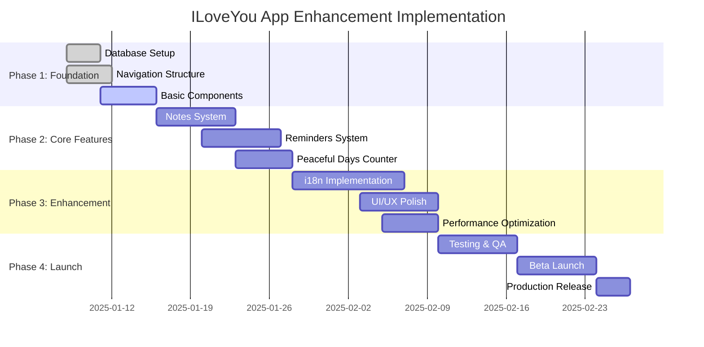

# Implementation Roadmap & Development Plan

## Project Timeline Overview



## Phase 1: Foundation Setup (Week 1-2)

### Database Infrastructure
**Duration**: 3-4 days
**Priority**: Critical
**Dependencies**: None

#### Tasks
1. **Firestore Collection Setup**
   ```bash
   # Create collections with sample data
   - notes collection with indexes
   - reminders collection with indexes  
   - peacefulDays collection
   - i18nSettings collection
   ```

2. **Security Rules Implementation**
   ```javascript
   // Deploy enhanced Firestore security rules
   firebase deploy --only firestore:rules
   ```

3. **Firebase Storage Configuration**
   ```bash
   # Setup storage buckets for media
   - Configure CORS for web access
   - Set up storage security rules
   - Create folder structure
   ```

#### Acceptance Criteria
- [ ] All new collections created and indexed
- [ ] Security rules tested and deployed
- [ ] Sample data can be read/written successfully
- [ ] Storage buckets configured for media uploads

### Navigation Architecture Update
**Duration**: 4-5 days
**Priority**: Critical
**Dependencies**: Database setup

#### Tasks
1. **Enhanced Tab Navigation**
   ```javascript
   // Update AppNavigator.js
   - Add Home tab with Dashboard
   - Add Notes tab with stack navigation
   - Restructure existing tabs
   ```

2. **New Stack Navigators**
   ```javascript
   // Create new stack navigators
   - HomeStack (Dashboard, PeacefulDaysDetail, QuickActions)
   - NotesStack (NotesList, NoteDetail, NoteEdit, SharedNotes)
   - Enhanced ProfileStack (add reminders screens)
   - Enhanced SettingsStack (add language settings)
   ```

3. **Deep Linking Updates**
   ```javascript
   // Extend linking configuration
   - Add new screen routes
   - Test deep link navigation
   ```

#### Acceptance Criteria
- [ ] 5-tab navigation working correctly
- [ ] All new screens accessible via navigation
- [ ] Deep linking works for new routes
- [ ] Navigation state persistence maintained

### Basic Component Development
**Duration**: 5-6 days
**Priority**: High
**Dependencies**: Navigation structure

#### Tasks
1. **Core UI Components**
   ```javascript
   // New love-themed components
   - NoteCard component
   - ReminderCard component
   - PeacefulDaysCounter component
   - CategoryTabs component
   - FloatingActionButton component
   ```

2. **Form Components**
   ```javascript
   // Enhanced form components
   - RichTextEditor for notes
   - DateTimePicker for reminders
   - CategorySelector component
   - MediaUploadComponent
   ```

3. **Dashboard Components**
   ```javascript
   // Dashboard specific components
   - LoveStatsCard component
   - RecentActivityCard component
   - QuickActionsGrid component
   - UpcomingRemindersCard component
   ```

#### Acceptance Criteria
- [ ] All new components render correctly
- [ ] Components follow existing love theme
- [ ] Responsive design on different screen sizes
- [ ] Components are accessible and testable

## Phase 2: Core Feature Implementation (Week 3-5)

### Notes System Development
**Duration**: 7-8 days
**Priority**: High
**Dependencies**: Basic components, database setup

#### Sprint Breakdown

**Days 1-3: CRUD Operations**
```javascript
// Implement core note operations
- Create note functionality
- Read notes with pagination
- Update note content
- Delete notes with confirmation
- Real-time sync between partners
```

**Days 4-5: Rich Content**
```javascript
// Add rich media support
- Image upload and display
- Voice recording and playback
- Text formatting options
- Category and tag management
```

**Days 6-7: Collaboration Features**
```javascript
// Shared notes functionality
- Partner sharing controls
- Real-time collaborative editing
- Comment system on shared notes
- Edit history tracking
```

#### Technical Implementation
```javascript
// Key service methods to implement
export const createNote = async (noteData) => { /* */ };
export const updateNote = async (noteId, updates) => { /* */ };
export const shareNoteWithPartner = async (noteId, partnerId) => { /* */ };
export const subscribeToSharedNotes = (coupleId, callback) => { /* */ };
```

#### Acceptance Criteria
- [ ] Users can create, edit, delete notes
- [ ] Rich media uploads work correctly
- [ ] Shared notes sync in real-time
- [ ] Category system functional
- [ ] Search and filtering works

### Reminders System Development
**Duration**: 7-8 days
**Priority**: High
**Dependencies**: Notes system, push notification setup

#### Sprint Breakdown

**Days 1-2: Push Notification Setup**
```bash
# Configure Expo notifications
npm install expo-notifications
# Setup notification permissions and handlers
```

**Days 3-5: Core Reminder Logic**
```javascript
// Implement reminder operations
- Create reminders with scheduling
- Recurring reminder logic
- Notification triggering
- Reminder completion tracking
```

**Days 6-7: Partner Integration**
```javascript
// Couple reminder features
- Shared reminders between partners
- Partner notification system
- Reminder delegation
- Couple milestone reminders
```

#### Technical Implementation
```javascript
// Key service methods to implement
export const createReminder = async (reminderData) => { /* */ };
export const scheduleNotification = async (reminder) => { /* */ };
export const handleReminderCompletion = async (reminderId, userId) => { /* */ };
export const syncCoupleReminders = async (coupleId) => { /* */ };
```

#### Acceptance Criteria
- [ ] Reminders can be created and scheduled
- [ ] Push notifications work reliably
- [ ] Recurring reminders function correctly
- [ ] Partner reminders sync properly
- [ ] Completion tracking works

### Peaceful Days Counter Implementation
**Duration**: 5-6 days
**Priority**: Medium-High
**Dependencies**: Dashboard components

#### Sprint Breakdown

**Days 1-2: Core Counter Logic**
```javascript
// Implement peaceful days tracking
- Counter increment/reset functionality
- Streak calculation logic
- Historical data tracking
- Partner synchronization
```

**Days 3-4: Dashboard Integration**
```javascript
// Visual implementation
- Prominent counter display on home screen
- Milestone celebration animations
- Progress visualization charts
- Achievement badges
```

**Days 5: Partner Coordination**
```javascript
// Couple coordination features
- Partner confirmation for resets
- Synchronized counting
- Shared milestone celebrations
- Conflict resolution system
```

#### Technical Implementation
```javascript
// Key service methods to implement
export const incrementPeacefulDays = async (coupleId) => { /* */ };
export const resetPeacefulDays = async (coupleId, resetReason) => { /* */ };
export const checkMilestones = async (coupleId) => { /* */ };
export const celebrateMilestone = async (coupleId, milestone) => { /* */ };
```

#### Acceptance Criteria
- [ ] Counter increments/resets correctly
- [ ] Milestones are detected and celebrated
- [ ] Partner synchronization works
- [ ] Historical data is preserved
- [ ] Visual design is engaging

## Phase 3: Enhancement & Localization (Week 6-8)

### Vietnamese Internationalization
**Duration**: 10-12 days
**Priority**: Medium
**Dependencies**: All core features complete

#### Sprint Breakdown

**Days 1-3: i18n Infrastructure**
```bash
# Setup internationalization
npm install i18n-js react-native-localize
# Configure language detection and switching
```

**Days 4-7: Content Translation**
```javascript
// Complete app translation
- Extract all text strings
- Translate to Vietnamese with romantic tone
- Cultural adaptation of phrases
- Date/time localization
```

**Days 8-10: Testing & Refinement**
```javascript
// Vietnamese user testing
- Cultural sensitivity review
- Language switching testing
- Regional format testing
- User feedback integration
```

#### Translation Guidelines
```javascript
// Romantic Vietnamese phrases examples
{
  "en": "I love you",
  "vi": "Anh yêu em" // or "Em yêu anh" based on context
}

{
  "en": "Our love story",
  "vi": "Câu chuyện tình yêu của chúng ta"
}

{
  "en": "Peaceful days together",
  "vi": "Những ngày bình yên bên nhau"
}
```

#### Acceptance Criteria
- [ ] Complete Vietnamese translation implemented
- [ ] Language switching works seamlessly
- [ ] Cultural tone is appropriate and romantic
- [ ] Regional formats (date/time) work correctly
- [ ] Vietnamese users can use app fully

### UI/UX Polish & Performance
**Duration**: 7-8 days
**Priority**: Medium-High
**Dependencies**: Feature completeness

#### Sprint Breakdown

**Days 1-3: Animation & Transitions**
```javascript
// Enhanced user experience
- Smooth screen transitions
- Loading state animations
- Celebration animations for milestones
- Interactive feedback
```

**Days 4-5: Performance Optimization**
```javascript
// Performance improvements
- Image optimization and caching
- Efficient data loading
- Memory usage optimization
- Background task optimization
```

**Days 6-7: Accessibility & Polish**
```javascript
// Final polish
- Accessibility improvements
- Error state handling
- Edge case testing
- Visual design refinements
```

#### Acceptance Criteria
- [ ] Smooth animations throughout app
- [ ] Fast loading times maintained
- [ ] Accessible to users with disabilities
- [ ] Professional visual polish
- [ ] Robust error handling

## Phase 4: Testing & Launch (Week 9-11)

### Comprehensive Testing
**Duration**: 7-8 days
**Priority**: Critical
**Dependencies**: Feature completeness

#### Testing Strategy
```javascript
// Testing priorities
1. Core functionality testing
2. Cross-platform compatibility
3. Performance benchmarking
4. Security testing
5. User acceptance testing
```

#### Test Cases
```javascript
// Critical test scenarios
- User registration and couple connection
- Note creation, editing, sharing
- Reminder scheduling and notifications
- Peaceful days counter accuracy
- Language switching
- Data synchronization
- Offline functionality
- Media upload/download
```

### Beta Launch
**Duration**: 7 days
**Priority**: High
**Dependencies**: Testing completion

#### Beta User Groups
1. **English-speaking couples** (50% of beta users)
2. **Vietnamese couples** (40% of beta users)
3. **Mixed language couples** (10% of beta users)

#### Feedback Collection
```javascript
// Feedback mechanisms
- In-app feedback forms
- User interviews
- Analytics tracking
- Crash reporting
- Performance monitoring
```

### Production Release
**Duration**: 3-4 days
**Priority**: Critical
**Dependencies**: Beta feedback integration

#### Release Checklist
- [ ] All critical bugs fixed
- [ ] Performance benchmarks met
- [ ] Security audit completed
- [ ] App store metadata prepared
- [ ] Analytics and monitoring configured
- [ ] Support documentation ready

## Risk Mitigation Strategies

### Technical Risks

**Risk**: Real-time sync conflicts in shared notes
```javascript
// Mitigation: Operational Transform implementation
- Use Firestore transactions for critical updates
- Implement conflict resolution UI
- Add edit history for rollback capability
```

**Risk**: Push notification reliability issues
```javascript
// Mitigation: Fallback notification strategies
- In-app notification system
- SMS fallback for critical reminders
- Email notification option
```

**Risk**: Performance degradation with large datasets
```javascript
// Mitigation: Efficient data management
- Implement pagination for all lists
- Use virtual scrolling for large datasets
- Background data cleanup jobs
```

### Product Risks

**Risk**: Cultural insensitivity in Vietnamese translation
```javascript
// Mitigation: Cultural expert consultation
- Native Vietnamese speaker review
- Cultural sensitivity testing
- Community feedback integration
```

**Risk**: Feature overwhelm for existing users
```javascript
// Mitigation: Gradual feature introduction
- Feature flags for controlled rollout
- Progressive disclosure in UI
- User onboarding for new features
```

## Success Metrics & KPIs

### Development Success
- **Code Quality**: 90%+ test coverage for new features
- **Performance**: <3 second app launch time
- **Stability**: <1% crash rate in production

### User Engagement
- **Feature Adoption**: 70%+ users try new features within 1 week
- **Daily Usage**: 25% increase in daily active users
- **Session Duration**: 20% increase in average session time

### Cultural Success
- **Vietnamese Adoption**: 60%+ Vietnamese users prefer Vietnamese language
- **Cultural Rating**: 4.5+ stars on cultural appropriateness
- **Community Growth**: Positive Vietnamese community engagement

This roadmap provides a structured approach to implementing all four enhancement features while maintaining code quality, user experience, and cultural sensitivity.