# MinIO Integration Plan - ILoveYou Project
*Chi tiết plan tích hợp MinIO cho việc lưu trữ hình ảnh và video*

## 📊 COST ANALYSIS & RECOMMENDATION

### So sánh chi phí cho 2 users (monthly):

#### 1. **Firebase Storage** (hiện tại)
- **Free tier**: 1GB storage + 1GB/day download = **$0/tháng**
- **Paid**: $0.026/GB storage + $0.12/GB download
- **Ước tính cho 2 users**: ~$2-5/tháng (20-50GB)

#### 2. **Self-hosted MinIO** (KHUYẾN NGHỊ CHO CHI PHÍ THẤP NHẤT)
- **VPS nhỏ**: $3-5/tháng (1CPU, 1GB RAM, 25GB SSD)
- **Storage mở rộng**: +$0.10/GB/tháng
- **Ước tính tổng**: ~$5-8/tháng (unlimited bandwidth)

#### 3. **MinIO Cloud** 
- **Pricing**: $0.025/GB + egress fees
- **Ước tính**: ~$10-15/tháng

#### 4. **Docker MinIO trên shared hosting**
- **Chi phí**: $5-10/tháng
- **Limitations**: Có thể bị giới hạn resources

### 🏆 **RECOMMENDATION: Self-hosted MinIO trên VPS**
**Lý do:**
- ✅ Chi phí thấp nhất long-term (chỉ $5-8/tháng)
- ✅ Full control và unlimited bandwidth  
- ✅ Dễ backup và migrate
- ✅ Có thể scale sau này
- ✅ Learning experience tốt

---

## 🗓️ PLAN TỔNG QUAN (3-4 tuần)

```mermaid
gantt
    title MinIO Integration Timeline
    dateFormat  YYYY-MM-DD
    section Phase 1: Firebase Enhancement
    Hoàn thiện Firebase Storage    :p1, 2025-01-15, 7d
    Add video support             :after p1, 3d
    section Phase 2: Storage Abstraction
    Design Storage Layer          :p2, 2025-01-25, 4d
    Implement Storage Interface   :after p2, 3d
    section Phase 3: MinIO Integration  
    Setup MinIO Server           :p3, 2025-02-01, 3d
    Implement MinIO Client       :after p3, 4d
    section Phase 4: Migration & Optimization
    Data Migration Tool          :p4, 2025-02-08, 3d
    Performance Testing          :after p4, 4d
```



---

## 📋 CHI TIẾT TỪNG PHASE

### **PHASE 1: Hoàn thiện Firebase Storage (Tuần 1)**

#### 🎯 **Objectives**
- Hoàn thiện video upload support
- Cải thiện error handling và progress tracking
- Tối ưu image compression
- Thêm metadata management

#### 📝 **Tasks cụ thể**

**Task 1.1: Video Upload Support**
- [ ] Extend [`usePhotoUpload.js`](web/src/hooks/usePhotoUpload.js:1) to support video
- [ ] Add video preview in [`PhotoUpload.jsx`](web/src/components/notes/PhotoUpload.jsx:1)
- [ ] Implement video compression/optimization

**Task 1.2: Enhanced Error Handling**
- [ ] Add retry logic for failed uploads
- [ ] Implement upload queue management
- [ ] Add network status detection

**Task 1.3: Metadata & Organization**
- [ ] Add file categorization (photos/videos/documents)
- [ ] Implement tagging system
- [ ] Add upload timestamp và user metadata

#### 🔧 **Files cần tạo/chỉnh sửa**

```javascript
// web/src/hooks/useMediaUpload.js (mở rộng từ usePhotoUpload.js)
export const useMediaUpload = () => {
  const uploadMedia = async (file, folder = 'media', options = {}) => {
    const { compress = true, generateThumbnail = false } = options;
    
    // Video handling
    if (file.type.startsWith('video/')) {
      return await uploadVideo(file, folder, options);
    }
    
    // Image handling (existing logic)
    return await uploadImage(file, folder, options);
  };

  const uploadVideo = async (file, folder, options) => {
    // Video compression logic
    // Thumbnail generation
    // Progress tracking
  };
};
```

```javascript
// shared/services/firebase/storage.js (NEW)
import { ref, uploadBytes, getDownloadURL } from 'firebase/storage';
import { storage } from './config';

export class FirebaseStorageService {
  async uploadFile(file, path, metadata = {}) {
    const storageRef = ref(storage, path);
    const uploadTask = uploadBytes(storageRef, file, metadata);
    
    return {
      url: await getDownloadURL(uploadTask.ref),
      path,
      metadata: {
        ...metadata,
        uploadedAt: new Date().toISOString(),
        size: file.size,
        type: file.type
      }
    };
  }

  async deleteFile(path) {
    const storageRef = ref(storage, path);
    return deleteObject(storageRef);
  }
}
```

#### 🧪 **Testing Strategy**
- Unit tests cho upload functions
- Integration tests với Firebase
- Performance tests cho large files
- Error scenario testing

---

### **PHASE 2: Storage Abstraction Layer (Tuần 2)**

#### 🎯 **Objectives**
- Tạo storage adapter pattern
- Implement storage interface để switch giữa providers
- Prepare codebase cho multi-provider support

#### 📝 **Tasks cụ thể**

**Task 2.1: Storage Interface Design**
- [ ] Define universal storage interface
- [ ] Create provider abstraction
- [ ] Implement configuration management

**Task 2.2: Firebase Adapter**
- [ ] Wrap existing Firebase logic in adapter
- [ ] Implement interface methods
- [ ] Add provider-specific optimizations

**Task 2.3: Configuration System**
- [ ] Environment-based provider selection
- [ ] Runtime provider switching
- [ ] Fallback mechanism design

#### 🔧 **Code Architecture**

```javascript
// shared/services/storage/interfaces/IStorageProvider.js
export interface IStorageProvider {
  uploadFile(file: File, path: string, options?: UploadOptions): Promise<StorageResult>;
  deleteFile(path: string): Promise<void>;
  getFileUrl(path: string): Promise<string>;
  getFileMetadata(path: string): Promise<FileMetadata>;
  listFiles(prefix: string): Promise<FileList>;
}

export interface StorageResult {
  url: string;
  path: string;
  metadata: FileMetadata;
}

export interface UploadOptions {
  compress?: boolean;
  generateThumbnail?: boolean;
  metadata?: Record<string, any>;
  onProgress?: (progress: number) => void;
}
```

```javascript
// shared/services/storage/providers/FirebaseStorageProvider.js
import { IStorageProvider } from '../interfaces/IStorageProvider';
import { FirebaseStorageService } from '../firebase/storage';

export class FirebaseStorageProvider implements IStorageProvider {
  constructor(config) {
    this.storage = new FirebaseStorageService(config);
  }

  async uploadFile(file, path, options = {}) {
    return this.storage.uploadFile(file, path, options);
  }

  async deleteFile(path) {
    return this.storage.deleteFile(path);
  }

  // ... implement other interface methods
}
```

```javascript
// shared/services/storage/StorageManager.js
export class StorageManager {
  constructor() {
    this.providers = new Map();
    this.activeProvider = null;
  }

  registerProvider(name, provider) {
    this.providers.set(name, provider);
  }

  setActiveProvider(name) {
    if (!this.providers.has(name)) {
      throw new Error(`Provider ${name} not found`);
    }
    this.activeProvider = this.providers.get(name);
  }

  async uploadFile(file, path, options = {}) {
    if (!this.activeProvider) {
      throw new Error('No active storage provider');
    }
    return this.activeProvider.uploadFile(file, path, options);
  }

  // Fallback mechanism
  async uploadFileWithFallback(file, path, options = {}) {
    const errors = [];
    
    for (const [name, provider] of this.providers) {
      try {
        return await provider.uploadFile(file, path, options);
      } catch (error) {
        errors.push({ provider: name, error });
      }
    }
    
    throw new Error(`All providers failed: ${JSON.stringify(errors)}`);
  }
}
```

---

### **PHASE 3: MinIO Integration (Tuần 3)**

#### 🎯 **Objectives**
- Setup MinIO server (cost-effective VPS solution)
- Implement MinIO client adapter
- Integrate with existing application
- Setup security và authentication

#### 📝 **Tasks cụ thể**

**Task 3.1: MinIO Server Setup**
- [ ] VPS setup (Ubuntu 22.04 LTS)
- [ ] MinIO installation và configuration
- [ ] SSL certificate setup (Let's Encrypt)
- [ ] Backup strategy implementation

**Task 3.2: MinIO Client Implementation**
- [ ] Install MinIO JavaScript SDK
- [ ] Create MinIO adapter
- [ ] Implement presigned URLs
- [ ] Add CDN integration (optional)

**Task 3.3: Security & Authentication**
- [ ] JWT token integration với Firebase Auth
- [ ] Bucket policies setup
- [ ] CORS configuration
- [ ] Rate limiting implementation

#### 🖥️ **MinIO Server Setup Script**

```bash
#!/bin/bash
# scripts/setup-minio-server.sh

# Update system
sudo apt update && sudo apt upgrade -y

# Install MinIO
wget https://dl.min.io/server/minio/release/linux-amd64/minio
chmod +x minio
sudo mv minio /usr/local/bin/

# Create minio user
sudo useradd -r minio-user -s /sbin/nologin

# Create directories
sudo mkdir -p /opt/minio/data
sudo mkdir -p /opt/minio/config
sudo chown -R minio-user:minio-user /opt/minio

# Create systemd service
sudo tee /etc/systemd/system/minio.service << EOF
[Unit]
Description=MinIO
Documentation=https://docs.min.io
Wants=network-online.target
After=network-online.target
AssertFileIsExecutable=/usr/local/bin/minio

[Service]
WorkingDirectory=/opt/minio
User=minio-user
Group=minio-user
ExecStart=/usr/local/bin/minio server /opt/minio/data --console-address ":9090"
Restart=always
RestartSec=5
Environment="MINIO_ROOT_USER=admin"
Environment="MINIO_ROOT_PASSWORD=your-secure-password-here"

[Install]
WantedBy=multi-user.target
EOF

# Start MinIO
sudo systemctl daemon-reload
sudo systemctl enable minio
sudo systemctl start minio

# Install Nginx for reverse proxy
sudo apt install nginx -y

# Configure Nginx
sudo tee /etc/nginx/sites-available/minio << EOF
server {
    listen 80;
    server_name your-domain.com;
    
    location / {
        proxy_pass http://localhost:9000;
        proxy_set_header Host \$host;
        proxy_set_header X-Real-IP \$remote_addr;
    }
    
    location /console/ {
        proxy_pass http://localhost:9090;
        proxy_set_header Host \$host;
        proxy_set_header X-Real-IP \$remote_addr;
    }
}
EOF

sudo ln -s /etc/nginx/sites-available/minio /etc/nginx/sites-enabled/
sudo systemctl restart nginx

# Install Certbot for SSL
sudo apt install certbot python3-certbot-nginx -y
sudo certbot --nginx -d your-domain.com
```

#### 🔧 **MinIO Client Implementation**

```javascript
// shared/services/storage/providers/MinIOStorageProvider.js
import { Client } from 'minio';
import { IStorageProvider } from '../interfaces/IStorageProvider';

export class MinIOStorageProvider implements IStorageProvider {
  constructor(config) {
    this.client = new Client({
      endPoint: config.endpoint,
      port: config.port || 443,
      useSSL: config.useSSL || true,
      accessKey: config.accessKey,
      secretKey: config.secretKey
    });
    
    this.bucketName = config.bucketName || 'iloveyou-media';
    this.baseUrl = config.baseUrl;
  }

  async initializeBucket() {
    const exists = await this.client.bucketExists(this.bucketName);
    if (!exists) {
      await this.client.makeBucket(this.bucketName);
      
      // Set bucket policy for public read
      const policy = {
        Version: '2012-10-17',
        Statement: [{
          Effect: 'Allow',
          Principal: { AWS: ['*'] },
          Action: ['s3:GetObject'],
          Resource: [`arn:aws:s3:::${this.bucketName}/public/*`]
        }]
      };
      
      await this.client.setBucketPolicy(this.bucketName, JSON.stringify(policy));
    }
  }

  async uploadFile(file, path, options = {}) {
    const { generateThumbnail = false, metadata = {} } = options;
    
    // Generate unique path
    const timestamp = Date.now();
    const sanitizedPath = path.replace(/[^a-zA-Z0-9\/\-_.]/g, '');
    const fullPath = `uploads/${sanitizedPath}/${timestamp}-${file.name}`;
    
    // Upload file
    const uploadInfo = await this.client.putObject(
      this.bucketName,
      fullPath,
      file.stream || file,
      file.size,
      {
        'Content-Type': file.type,
        ...metadata
      }
    );

    // Generate thumbnail if image
    if (generateThumbnail && file.type.startsWith('image/')) {
      await this.generateThumbnail(file, fullPath);
    }

    return {
      url: `${this.baseUrl}/${this.bucketName}/${fullPath}`,
      path: fullPath,
      metadata: {
        ...metadata,
        uploadedAt: new Date().toISOString(),
        size: file.size,
        type: file.type,
        etag: uploadInfo.etag
      }
    };
  }

  async deleteFile(path) {
    await this.client.removeObject(this.bucketName, path);
    
    // Also delete thumbnail if exists
    const thumbnailPath = this.getThumbnailPath(path);
    try {
      await this.client.removeObject(this.bucketName, thumbnailPath);
    } catch (error) {
      // Thumbnail might not exist, ignore error
    }
  }

  async getPresignedUrl(path, expiry = 3600) {
    return this.client.presignedGetObject(this.bucketName, path, expiry);
  }

  async generateThumbnail(file, originalPath) {
    // Implementation for thumbnail generation
    // Could use sharp library or canvas API
  }

  getThumbnailPath(originalPath) {
    const pathParts = originalPath.split('/');
    const filename = pathParts.pop();
    const directory = pathParts.join('/');
    return `${directory}/thumbnails/thumb_${filename}`;
  }
}
```

#### 🔐 **Security Configuration**

```javascript
// shared/services/storage/auth/StorageAuthManager.js
export class StorageAuthManager {
  constructor(firebaseAuth) {
    this.firebaseAuth = firebaseAuth;
  }

  async getStorageCredentials(userId) {
    // Get Firebase ID token
    const idToken = await this.firebaseAuth.currentUser.getIdToken();
    
    // Call Firebase function to get MinIO credentials
    const response = await fetch('/api/getStorageCredentials', {
      method: 'POST',
      headers: {
        'Authorization': `Bearer ${idToken}`,
        'Content-Type': 'application/json'
      },
      body: JSON.stringify({ userId })
    });

    return response.json();
  }

  async refreshCredentials() {
    // Implement credential refresh logic
  }
}
```

#### 🔧 **Dependencies cần thêm**

```json
// web/package.json - thêm vào dependencies
{
  "minio": "^7.1.3",
  "sharp": "^0.32.6",
  "uuid": "^9.0.1"
}
```

---

### **PHASE 4: Migration & Optimization (Tuần 4)**

#### 🎯 **Objectives**
- Data migration từ Firebase sang MinIO
- Performance optimization
- Monitoring setup
- Deployment automation

#### 📝 **Tasks cụ thể**

**Task 4.1: Data Migration**
- [ ] Create migration scripts
- [ ] Implement progressive migration
- [ ] Data validation tools
- [ ] Rollback procedures

**Task 4.2: Performance Optimization**
- [ ] Image optimization pipeline
- [ ] CDN integration (CloudFlare)
- [ ] Caching strategies
- [ ] Lazy loading enhancements

**Task 4.3: Monitoring & Logging**
- [ ] MinIO metrics collection
- [ ] Error tracking setup
- [ ] Performance monitoring
- [ ] Cost tracking dashboard

#### 🔄 **Migration Strategy**

```javascript
// scripts/migrate-firebase-to-minio.js
import { FirebaseStorageProvider } from '../shared/services/storage/providers/FirebaseStorageProvider';
import { MinIOStorageProvider } from '../shared/services/storage/providers/MinIOStorageProvider';

export class StorageMigrationTool {
  constructor(firebaseProvider, minioProvider) {
    this.firebase = firebaseProvider;
    this.minio = minioProvider;
    this.migrationLog = [];
  }

  async migrateAllFiles() {
    console.log('Starting migration from Firebase to MinIO...');
    
    // Get all files from Firebase
    const files = await this.firebase.listFiles('');
    
    for (const file of files) {
      try {
        await this.migrateFile(file);
        this.logSuccess(file.path);
      } catch (error) {
        this.logError(file.path, error);
      }
    }

    await this.generateMigrationReport();
  }

  async migrateFile(fileInfo) {
    // Download from Firebase
    const fileBlob = await fetch(fileInfo.url).then(r => r.blob());
    
    // Upload to MinIO
    const result = await this.minio.uploadFile(fileBlob, fileInfo.path, {
      metadata: fileInfo.metadata
    });

    // Verify upload
    const minioMetadata = await this.minio.getFileMetadata(result.path);
    if (minioMetadata.size !== fileInfo.metadata.size) {
      throw new Error('File size mismatch after migration');
    }

    return result;
  }

  async generateMigrationReport() {
    const report = {
      totalFiles: this.migrationLog.length,
      successful: this.migrationLog.filter(l => l.status === 'success').length,
      failed: this.migrationLog.filter(l => l.status === 'error').length,
      details: this.migrationLog
    };

    console.log('Migration Report:', report);
    
    // Save report to file
    const fs = await import('fs/promises');
    await fs.writeFile(
      'migration-report.json', 
      JSON.stringify(report, null, 2)
    );
  }
}
```

#### 📊 **Performance Monitoring**

```javascript
// shared/services/storage/monitoring/StorageMonitor.js
export class StorageMonitor {
  constructor() {
    this.metrics = {
      uploads: 0,
      downloads: 0,
      errors: 0,
      totalSize: 0,
      avgUploadTime: 0
    };
  }

  trackUpload(startTime, fileSize, success = true) {
    const duration = Date.now() - startTime;
    
    if (success) {
      this.metrics.uploads++;
      this.metrics.totalSize += fileSize;
      this.updateAvgUploadTime(duration);
    } else {
      this.metrics.errors++;
    }

    this.sendMetrics();
  }

  updateAvgUploadTime(newDuration) {
    const totalUploads = this.metrics.uploads;
    this.metrics.avgUploadTime = (
      (this.metrics.avgUploadTime * (totalUploads - 1) + newDuration) / totalUploads
    );
  }

  async sendMetrics() {
    // Send to analytics service hoặc console log
    console.log('Storage Metrics:', this.metrics);
  }
}
```

---

## 🔧 TECHNICAL SPECIFICATIONS

### **MinIO Configuration**

#### Server Configuration
```yaml
# docker-compose.yml cho development
version: '3.8'
services:
  minio:
    image: minio/minio:latest
    container_name: iloveyou-minio
    ports:
      - "9000:9000"
      - "9090:9090"
    environment:
      - MINIO_ROOT_USER=admin
      - MINIO_ROOT_PASSWORD=password123
    command: server /data --console-address ":9090"
    volumes:
      - ./minio-data:/data
    healthcheck:
      test: ["CMD", "curl", "-f", "http://localhost:9000/minio/health/live"]
      interval: 30s
      timeout: 20s
      retries: 3
```

#### Bucket Structure
```
iloveyou-media/
├── uploads/
│   ├── notes/
│   │   ├── {userId}/
│   │   │   ├── images/
│   │   │   ├── videos/
│   │   │   └── thumbnails/
│   ├── profiles/
│   └── shared/
├── backups/
└── temp/
```

### **Security Model**

#### JWT Integration với Firebase Auth
```javascript
// Firebase Cloud Function
export const getMinIOCredentials = functions.https.onCall(async (data, context) => {
  // Verify Firebase Auth
  if (!context.auth) {
    throw new functions.https.HttpsError('unauthenticated', 'Must be authenticated');
  }

  const userId = context.auth.uid;
  
  // Generate temporary MinIO credentials
  const credentials = {
    accessKey: `temp_${userId}_${Date.now()}`,
    secretKey: generateSecureToken(),
    sessionToken: generateSessionToken(userId),
    expiry: Date.now() + (60 * 60 * 1000) // 1 hour
  };

  // Store in Firestore for validation
  await admin.firestore().collection('temp_credentials').doc(userId).set(credentials);

  return credentials;
});
```

### **CDN Integration Strategy**

#### CloudFlare Integration
```javascript
// shared/services/cdn/CloudFlareManager.js
export class CloudFlareManager {
  constructor(config) {
    this.zoneId = config.zoneId;
    this.apiToken = config.apiToken;
    this.baseUrl = config.baseUrl;
  }

  async purgeCache(paths) {
    const response = await fetch(
      `https://api.cloudflare.com/client/v4/zones/${this.zoneId}/purge_cache`,
      {
        method: 'POST',
        headers: {
          'Authorization': `Bearer ${this.apiToken}`,
          'Content-Type': 'application/json',
        },
        body: JSON.stringify({
          files: paths.map(path => `${this.baseUrl}/${path}`)
        })
      }
    );

    return response.json();
  }

  generateOptimizedUrl(originalUrl, options = {}) {
    const { width, height, quality = 80, format = 'auto' } = options;
    
    // CloudFlare Image Resizing
    const params = new URLSearchParams({
      width: width?.toString(),
      height: height?.toString(),
      quality: quality.toString(),
      format
    });

    return `${originalUrl}?${params.toString()}`;
  }
}
```

---

## 🗺️ IMPLEMENTATION ROADMAP

### **Priorities & Dependencies**


### **Risk Mitigation**

#### High Priority Risks
1. **MinIO Server Downtime**
   - **Mitigation**: Implement automatic fallback to Firebase
   - **Monitoring**: Health checks every 30 seconds
   - **Recovery**: Automated restart scripts

2. **Data Loss During Migration**
   - **Mitigation**: Progressive migration với verification
   - **Backup**: Keep Firebase data until verification complete
   - **Testing**: Dry-run migration trên test environment

3. **Performance Degradation**
   - **Mitigation**: CDN implementation
   - **Monitoring**: Response time tracking
   - **Optimization**: Image compression pipeline

#### Medium Priority Risks
1. **SSL Certificate Expiry**
   - **Mitigation**: Automated renewal với certbot
   - **Monitoring**: Certificate expiry alerts

2. **Storage Costs Escalation**
   - **Mitigation**: Usage monitoring và alerts
   - **Optimization**: Automated cleanup old files

### **Rollback Strategies**

#### Quick Rollback (< 5 minutes)
```javascript
// Emergency rollback to Firebase
export const emergencyRollback = async () => {
  // Switch storage provider
  storageManager.setActiveProvider('firebase');
  
  // Update environment config
  process.env.STORAGE_PROVIDER = 'firebase';
  
  // Clear MinIO cache
  localStorage.removeItem('minio_credentials');
  
  console.log('Emergency rollback to Firebase completed');
};
```

#### Full Rollback (< 30 minutes)
1. Switch DNS back to Firebase Storage
2. Update application configuration
3. Restart application services
4. Verify all upload/download functions

---

## 🏗️ CODE ARCHITECTURE

### **Storage Adapter Pattern**


### **Service Layer Design**

```javascript
// shared/services/storage/index.js
export class StorageService {
  constructor() {
    this.manager = new StorageManager();
    this.monitor = new StorageMonitor();
    this.authManager = new StorageAuthManager();
    
    this.initializeProviders();
  }

  async initializeProviders() {
    // Initialize Firebase provider
    const firebaseProvider = new FirebaseStorageProvider({
      // Firebase config
    });
    
    // Initialize MinIO provider
    const minioProvider = new MinIOStorageProvider({
      endpoint: process.env.MINIO_ENDPOINT,
      accessKey: process.env.MINIO_ACCESS_KEY,
      secretKey: process.env.MINIO_SECRET_KEY,
      bucketName: process.env.MINIO_BUCKET_NAME
    });

    this.manager.registerProvider('firebase', firebaseProvider);
    this.manager.registerProvider('minio', minioProvider);
    
    // Set active provider based on environment
    const activeProvider = process.env.STORAGE_PROVIDER || 'firebase';
    this.manager.setActiveProvider(activeProvider);
  }

  async uploadFile(file, path, options = {}) {
    const startTime = Date.now();
    
    try {
      const result = await this.manager.uploadFileWithFallback(file, path, options);
      this.monitor.trackUpload(startTime, file.size, true);
      return result;
    } catch (error) {
      this.monitor.trackUpload(startTime, file.size, false);
      throw error;
    }
  }
}

// Export singleton instance
export const storageService = new StorageService();
```

### **Error Handling Strategy**

```javascript
// shared/services/storage/errors/StorageErrors.js
export class StorageError extends Error {
  constructor(message, code, provider, originalError) {
    super(message);
    this.name = 'StorageError';
    this.code = code;
    this.provider = provider;
    this.originalError = originalError;
    this.timestamp = new Date().toISOString();
  }
}

export class StorageErrorHandler {
  static handle(error, context = {}) {
    console.error('Storage Error:', {
      error: error.message,
      code: error.code,
      provider: error.provider,
      context,
      timestamp: error.timestamp
    });

    // Send to error tracking service
    if (typeof window !== 'undefined' && window.Sentry) {
      window.Sentry.captureException(error, { contexts: { storage: context } });
    }

    // Return user-friendly message
    return this.getUserFriendlyMessage(error.code);
  }

  static getUserFriendlyMessage(code) {
    const messages = {
      'UPLOAD_FAILED': 'Không thể tải lên file. Vui lòng thử lại.',
      'FILE_TOO_LARGE': 'File quá lớn. Vui lòng chọn file nhỏ hơn.',
      'INVALID_FILE_TYPE': 'Định dạng file không được hỗ trợ.',
      'NETWORK_ERROR': 'Lỗi kết nối mạng. Vui lòng kiểm tra internet.',
      'STORAGE_QUOTA_EXCEEDED': 'Dung lượng lưu trữ đã đầy.',
      'UNAUTHORIZED': 'Không có quyền truy cập.'
    };

    return messages[code] || 'Đã xảy ra lỗi không xác định.';
  }
}
```

### **Migration Scripts Structure**

```javascript
// scripts/migration/MigrationOrchestrator.js
export class MigrationOrchestrator {
  constructor() {
    this.migrations = [];
    this.currentStep = 0;
  }

  addMigration(migration) {
    this.migrations.push(migration);
  }

  async run() {
    console.log(`Starting migration with ${this.migrations.length} steps...`);
    
    for (let i = 0; i < this.migrations.length; i++) {
      this.currentStep = i;
      const migration = this.migrations[i];
      
      try {
        console.log(`Step ${i + 1}: ${migration.name}`);
        await migration.execute();
        console.log(`✅ Completed: ${migration.name}`);
      } catch (error) {
        console.error(`❌ Failed: ${migration.name}`, error);
        await this.rollback();
        throw error;
      }
    }

    console.log('🎉 Migration completed successfully!');
  }

  async rollback() {
    console.log('Starting rollback...');
    
    for (let i = this.currentStep; i >= 0; i--) {
      const migration = this.migrations[i];
      if (migration.rollback) {
        try {
          await migration.rollback();
          console.log(`⏪ Rolled back: ${migration.name}`);
        } catch (error) {
          console.error(`❌ Rollback failed: ${migration.name}`, error);
        }
      }
    }
  }
}

// Usage
const orchestrator = new MigrationOrchestrator();

orchestrator.addMigration(new SetupMinIOServerMigration());
orchestrator.addMigration(new MigrateUserDataMigration());
orchestrator.addMigration(new UpdateDatabaseReferencesMigration());
orchestrator.addMigration(new VerifyMigrationMigration());

await orchestrator.run();
```

---

## 📈 PERFORMANCE OPTIMIZATION

### **Image Optimization Pipeline**

```javascript
// shared/services/storage/optimization/ImageOptimizer.js
export class ImageOptimizer {
  static async optimizeImage(file, options = {}) {
    const {
      maxWidth = 1920,
      maxHeight = 1080,
      quality = 0.8,
      format = 'webp'
    } = options;

    return new Promise((resolve) => {
      const canvas = document.createElement('canvas');
      const ctx = canvas.getContext('2d');
      const img = new Image();

      img.onload = () => {
        // Calculate dimensions
        const { width, height } = this.calculateDimensions(
          img.width, 
          img.height, 
          maxWidth, 
          maxHeight
        );

        canvas.width = width;
        canvas.height = height;

        // Draw và optimize
        ctx.drawImage(img, 0, 0, width, height);

        // Convert to optimized format
        canvas.toBlob(resolve, `image/${format}`, quality);
      };

      img.src = URL.createObjectURL(file);
    });
  }

  static calculateDimensions(originalWidth, originalHeight, maxWidth, maxHeight) {
    let { width, height } = { width: originalWidth, height: originalHeight };

    if (width > height) {
      if (width > maxWidth) {
        height = (height * maxWidth) / width;
        width = maxWidth;
      }
    } else {
      if (height > maxHeight) {
        width = (width * maxHeight) / height;
        height = maxHeight;
      }
    }

    return { width: Math.round(width), height: Math.round(height) };
  }
}
```

### **Caching Strategy**

```javascript
// shared/services/storage/cache/StorageCache.js
export class StorageCache {
  constructor(maxSize = 50 * 1024 * 1024) { // 50MB default
    this.cache = new Map();
    this.maxSize = maxSize;
    this.currentSize = 0;
  }

  async get(key) {
    const item = this.cache.get(key);
    if (!item) return null;

    // Check expiry
    if (Date.now() > item.expiry) {
      this.delete(key);
      return null;
    }

    // Update access time
    item.lastAccessed = Date.now();
    return item.data;
  }

  set(key, data, ttl = 3600000) { // 1 hour default
    const size = this.estimateSize(data);
    
    // Clear space if needed
    this.ensureSpace(size);

    const item = {
      data,
      size,
      expiry: Date.now() + ttl,
      lastAccessed: Date.now()
    };

    this.cache.set(key, item);
    this.currentSize += size;
  }

  ensureSpace(neededSize) {
    while (this.currentSize + neededSize > this.maxSize && this.cache.size > 0) {
      // Remove least recently used item
      const lruKey = this.findLRUKey();
      this.delete(lruKey);
    }
  }

  findLRUKey() {
    let lruKey = null;
    let oldestAccess = Date.now();

    for (const [key, item] of this.cache) {
      if (item.lastAccessed < oldestAccess) {
        oldestAccess = item.lastAccessed;
        lruKey = key;
      }
    }

    return lruKey;
  }

  delete(key) {
    const item = this.cache.get(key);
    if (item) {
      this.currentSize -= item.size;
      this.cache.delete(key);
    }
  }

  estimateSize(data) {
    // Rough estimation for different data types
    if (typeof data === 'string') return data.length * 2;
    if (data instanceof Blob) return data.size;
    if (data instanceof ArrayBuffer) return data.byteLength;
    return 1024; // Default 1KB for objects
  }
}
```

---

## 🔍 MONITORING & LOGGING

### **Comprehensive Monitoring Setup**

```javascript
// shared/services/storage/monitoring/StorageMetrics.js
export class StorageMetrics {
  constructor() {
    this.metrics = {
      uploads: {
        total: 0,
        successful: 0,
        failed: 0,
        avgDuration: 0,
        totalSize: 0
      },
      downloads: {
        total: 0,
        successful: 0,
        failed: 0,
        avgDuration: 0
      },
      errors: {
        total: 0,
        byType: {},
        byProvider: {}
      },
      performance: {
        avgUploadSpeed: 0, // MB/s
        avgDownloadSpeed: 0,
        cacheHitRate: 0
      }
    };

    this.startTime = Date.now();
  }

  trackUpload(startTime, fileSize, success, provider, error = null) {
    const duration = Date.now() - startTime;
    const sizeInMB = fileSize / (1024 * 1024);

    this.metrics.uploads.total++;
    
    if (success) {
      this.metrics.uploads.successful++;
      this.metrics.uploads.totalSize += fileSize;
      this.updateAvgUploadDuration(duration);
      this.updateAvgUploadSpeed(sizeInMB, duration);
    } else {
      this.metrics.uploads.failed++;
      this.trackError(error, provider);
    }

    this.sendMetrics();
  }

  trackError(error, provider) {
    this.metrics.errors.total++;
    
    const errorType = error?.code || 'UNKNOWN';
    this.metrics.errors.byType[errorType] = (this.metrics.errors.byType[errorType] || 0) + 1;
    this.metrics.errors.byProvider[provider] = (this.metrics.errors.byProvider[provider] || 0) + 1;
  }

  updateAvgUploadDuration(newDuration) {
    const total = this.metrics.uploads.successful;
    this.metrics.uploads.avgDuration = (
      (this.metrics.uploads.avgDuration * (total - 1) + newDuration) / total
    );
  }

  updateAvgUploadSpeed(sizeInMB, durationMs) {
    const speedMBps = sizeInMB / (durationMs / 1000);
    const total = this.metrics.uploads.successful;
    this.metrics.performance.avgUploadSpeed = (
      (this.metrics.performance.avgUploadSpeed * (total - 1) + speedMBps) / total
    );
  }

  generateReport() {
    const uptime = Date.now() - this.startTime;
    
    return {
      timestamp: new Date().toISOString(),
      uptime: uptime,
      metrics: this.metrics,
      health: {
        errorRate: this.metrics.errors.total / (this.metrics.uploads.total || 1),
        successRate: this.metrics.uploads.successful / (this.metrics.uploads.total || 1),
        avgUploadSpeed: this.metrics.performance.avgUploadSpeed
      }
    };
  }

  async sendMetrics() {
    // Send to monitoring service (e.g., DataDog, New Relic, custom endpoint)
    const report = this.generateReport();
    
    // Console logging for development
    if (process.env.NODE_ENV === 'development') {
      console.log('Storage Metrics:', report);
    }

    // Send to external monitoring service
    try {
      await fetch('/api/metrics/storage', {
        method: 'POST',
        headers: { 'Content-Type': 'application/json' },
        body: JSON.stringify(report)
      });
    } catch (error) {
      console.error('Failed to send metrics:', error);
    }
  }
}
```

---

## 💰 COST OPTIMIZATION SUMMARY

### **Recommended Solution: Self-hosted MinIO**

**Setup Cost**: ~$5-8/tháng cho VPS
**Operational Cost**: ~$3-5/tháng cho maintenance
**Total**: ~$8-13/tháng vs $2-5/tháng Firebase (cho 2 users)

**Break-even Analysis**:
- **Short term (< 6 tháng)**: Firebase rẻ hơn
- **Long term (> 1 năm)**: MinIO cost-effective hơn vì unlimited bandwidth
- **Learning value**: Rất cao với MinIO setup

### **Hybrid Approach** (Khuyến nghị cho production):
1. **Firebase Storage**: Primary cho critical data
2. **MinIO**: Secondary cho large media files
3. **Auto-failover**: Nếu MinIO down, fallback Firebase
4. **Cost optimization**: Large files → MinIO, Small files → Firebase

---

## 🎯 SUCCESS METRICS

### **Technical Metrics**
- [ ] Upload success rate > 99%
- [ ] Average upload time < 5 seconds
- [ ] Storage cost < $10/month
- [ ] Zero data loss during migration
- [ ] Fallback mechanism working < 30 seconds

### **User Experience Metrics**
- [ ] File upload working seamlessly
- [ ] Image preview loading < 2 seconds
- [ ] Video playback smooth performance
- [ ] Mobile experience unchanged
- [ ] Offline capability maintained

### **Business Metrics**
- [ ] Total storage cost reduction
- [ ] Scalability để handle growth
- [ ] Backup và disaster recovery
- [ ] Development learning experience
- [ ] Future maintenance complexity

---

## 📝 CONCLUSION

Plan này được thiết kế đặc biệt cho scale 2 users với focus trên cost optimization và learning experience. Self-hosted MinIO solution sẽ cung cấp:

✅ **Cost-effective** long-term solution
✅ **Full control** over storage infrastructure  
✅ **Unlimited bandwidth** cho media-heavy app
✅ **Learning opportunity** cho cloud infrastructure
✅ **Scalability** cho future growth
✅ **Fallback mechanism** cho high availability

**Timeline**: 3-4 tuần implementation với progressive rollout
**Risk**: Low với comprehensive fallback strategy
**ROI**: High cho long-term cost savings và technical skills

Ready để implement? 🚀