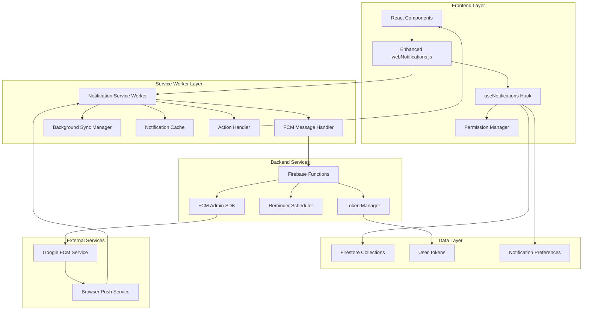
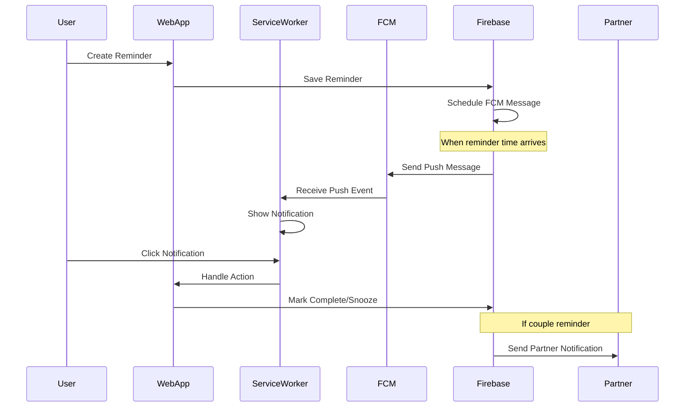

# Mobile Notifications Architecture for ILoveYou Web PWA

## Executive Summary

This document outlines the comprehensive architecture for implementing mobile notifications in the ILoveYou web Progressive Web App (PWA). The system will enhance the existing [`webNotifications.js`](web/src/services/webNotifications.js:1) service with Service Worker integration and Firebase Cloud Messaging (FCM) to provide reliable, offline-capable push notifications focused on reminder functionality for couples.

## Current State Analysis

### Existing Infrastructure ✅
- **Basic Web Notifications**: [`webNotifications.js`](web/src/services/webNotifications.js:1) with browser API integration
- **PWA Foundation**: [`vite-plugin-pwa`](web/vite.config.js:64) with Workbox configuration
- **Shared Notification Types**: [`shared/services/notifications/types.js`](shared/services/notifications/types.js:1) with predefined templates
- **Firebase Integration**: FCM-ready project configuration in [`shared/services/firebase/config.js`](shared/services/firebase/config.js:11)
- **Vietnamese Localization**: Built-in support for romantic Vietnamese notification templates

### Current Limitations
- No offline notification capability
- No background push notifications when app is closed
- Limited to browser-initiated notifications only
- No server-triggered push notifications
- No notification action handling in Service Worker

## Architecture Overview

### High-Level Architecture



### Data Flow Diagram



## Technical Specifications

### 1. Enhanced Service Worker Implementation

#### Core Service Worker Structure
```javascript
// sw.js - Enhanced notification service worker
import { precacheAndRoute } from 'workbox-precaching';
import { registerRoute } from 'workbox-routing';
import { NetworkFirst, CacheFirst } from 'workbox-strategies';

// Core PWA functionality
precacheAndRoute(self.__WB_MANIFEST);

// FCM Integration
import { initializeApp } from 'firebase/app';
import { getMessaging, onBackgroundMessage } from 'firebase/messaging/sw';

const app = initializeApp(firebaseConfig);
const messaging = getMessaging(app);

// Background message handler
onBackgroundMessage(messaging, (payload) => {
  console.log('Background message received: ', payload);
  
  const notificationTitle = payload.notification.title;
  const notificationOptions = {
    body: payload.notification.body,
    icon: '/icons/icon-192x192.png',
    badge: '/icons/badge-72x72.png',
    tag: payload.data.type,
    data: payload.data,
    actions: getNotificationActions(payload.data.type),
    requireInteraction: payload.data.urgent === 'true',
    silent: false,
    vibrate: [200, 100, 200]
  };

  return self.registration.showNotification(notificationTitle, notificationOptions);
});

// Notification click handler
self.addEventListener('notificationclick', (event) => {
  event.notification.close();
  
  const action = event.action;
  const data = event.notification.data;
  
  if (action === 'mark-complete') {
    handleMarkComplete(data);
  } else if (action === 'snooze') {
    handleSnooze(data);
  } else {
    handleNotificationClick(data);
  }
});

// Notification action handlers
function getNotificationActions(type) {
  if (type === 'reminder') {
    return [
      {
        action: 'mark-complete',
        title: '✅ Đánh dấu hoàn thành',
        icon: '/icons/complete.png'
      },
      {
        action: 'snooze',
        title: '⏰ Nhắc lại sau 10 phút',
        icon: '/icons/snooze.png'
      }
    ];
  }
  return [];
}
```

#### Service Worker Requirements
- **File Location**: [`web/public/sw.js`](web/public/sw.js:1)
- **Registration**: Enhanced in [`web/src/main.jsx`](web/src/main.jsx:1)
- **FCM Integration**: Background message handling
- **Notification Actions**: Complete, snooze, view actions
- **Offline Support**: Cache notification preferences and templates
- **Error Handling**: Graceful degradation when FCM unavailable

### 2. Enhanced webNotifications.js Service

#### Extended Service Class
```javascript
// Enhanced webNotifications.js
import { getMessaging, getToken, onMessage } from 'firebase/messaging';
import app from './firebase';
import { notificationTypes, notificationTemplates } from '@shared/services/notifications';

class EnhancedWebNotificationsService {
  constructor() {
    this.messaging = null;
    this.fcmToken = null;
    this.permission = 'default';
    this.isSupported = 'Notification' in window && 'serviceWorker' in navigator;
    this.language = 'vi'; // Default to Vietnamese
    this.init();
  }

  async init() {
    if (this.isSupported) {
      this.permission = Notification.permission;
      await this.initializeFCM();
    }
  }

  async initializeFCM() {
    try {
      this.messaging = getMessaging(app);
      
      // Register service worker
      const registration = await navigator.serviceWorker.register('/sw.js');
      console.log('Service Worker registered:', registration);
      
      // Get FCM token
      this.fcmToken = await getToken(this.messaging, {
        vapidKey: import.meta.env.VITE_FIREBASE_VAPID_KEY,
        serviceWorkerRegistration: registration
      });
      
      if (this.fcmToken) {
        await this.saveTokenToFirestore(this.fcmToken);
      }
      
      // Handle foreground messages
      onMessage(this.messaging, (payload) => {
        this.handleForegroundMessage(payload);
      });
      
    } catch (error) {
      console.error('FCM initialization failed:', error);
      // Gracefully degrade to basic notifications
    }
  }

  async requestPermission() {
    if (!this.isSupported) {
      return { success: false, error: 'Notifications not supported' };
    }

    try {
      const permission = await Notification.requestPermission();
      this.permission = permission;
      
      if (permission === 'granted') {
        await this.initializeFCM();
        return { success: true, token: this.fcmToken };
      } else {
        return { success: false, error: 'Permission denied' };
      }
    } catch (error) {
      console.error('Error requesting notification permission:', error);
      return { success: false, error: error.message };
    }
  }

  async showReminderNotification(reminder, options = {}) {
    const template = notificationTemplates.reminder[this.language];
    const title = template.title;
    const body = template.body(reminder.title);
    
    const notificationOptions = {
      body,
      icon: '/icons/icon-192x192.png',
      badge: '/icons/badge-72x72.png',
      tag: `reminder-${reminder.id}`,
      data: { 
        reminderId: reminder.id, 
        type: 'reminder',
        coupleId: reminder.coupleId 
      },
      actions: [
        {
          action: 'mark-complete',
          title: this.language === 'vi' ? '✅ Hoàn thành' : '✅ Complete'
        },
        {
          action: 'snooze',
          title: this.language === 'vi' ? '⏰ Nhắc lại sau' : '⏰ Snooze'
        }
      ],
      requireInteraction: reminder.priority === 'high',
      silent: false,
      vibrate: [200, 100, 200],
      ...options
    };

    return await this.showNotification(title, notificationOptions);
  }

  async saveTokenToFirestore(token) {
    // Save FCM token to user document for server-side messaging
    const user = auth.currentUser;
    if (user) {
      await updateDoc(doc(db, 'users', user.uid), {
        fcmToken: token,
        fcmTokenUpdated: serverTimestamp()
      });
    }
  }

  setLanguage(language) {
    this.language = language;
  }
}
```

### 3. Firebase Functions Backend

#### FCM Token Management
```javascript
// functions/src/notifications/fcmManager.js
const admin = require('firebase-admin');

class FCMManager {
  static async sendReminderNotification(userId, reminder) {
    try {
      const userDoc = await admin.firestore()
        .collection('users')
        .doc(userId)
        .get();
      
      const fcmToken = userDoc.data()?.fcmToken;
      if (!fcmToken) {
        console.log('No FCM token for user:', userId);
        return;
      }

      const message = {
        token: fcmToken,
        notification: {
          title: reminder.title,
          body: reminder.description || 'Bạn có một nhắc nhở mới!'
        },
        data: {
          type: 'reminder',
          reminderId: reminder.id,
          coupleId: reminder.coupleId || '',
          urgent: reminder.priority === 'high' ? 'true' : 'false'
        },
        webpush: {
          fcmOptions: {
            link: `${process.env.WEB_APP_URL}/reminders/${reminder.id}`
          },
          notification: {
            icon: '/icons/icon-192x192.png',
            badge: '/icons/badge-72x72.png',
            requireInteraction: reminder.priority === 'high',
            actions: [
              {
                action: 'mark-complete',
                title: '✅ Hoàn thành'
              },
              {
                action: 'snooze',
                title: '⏰ Nhắc lại'
              }
            ]
          }
        }
      };

      const response = await admin.messaging().send(message);
      console.log('FCM message sent successfully:', response);
      return response;
      
    } catch (error) {
      console.error('Error sending FCM message:', error);
      throw error;
    }
  }

  static async sendCoupleReminder(coupleId, reminder, creatorId) {
    try {
      const coupleDoc = await admin.firestore()
        .collection('couples')
        .doc(coupleId)
        .get();
      
      const members = coupleDoc.data()?.members || [];
      const partnerId = members.find(id => id !== creatorId);
      
      if (partnerId) {
        await this.sendReminderNotification(partnerId, {
          ...reminder,
          title: `💕 ${reminder.title}`,
          description: `Nhắc nhở từ người yêu: ${reminder.description}`
        });
      }
    } catch (error) {
      console.error('Error sending couple reminder:', error);
      throw error;
    }
  }
}

module.exports = FCMManager;
```

#### Reminder Scheduler Function
```javascript
// functions/src/notifications/reminderScheduler.js
const functions = require('firebase-functions');
const admin = require('firebase-admin');
const FCMManager = require('./fcmManager');

exports.scheduleReminder = functions.pubsub
  .schedule('every 1 minutes')
  .onRun(async (context) => {
    const now = admin.firestore.Timestamp.now();
    const fiveMinutesFromNow = admin.firestore.Timestamp.fromMillis(
      now.toMillis() + (5 * 60 * 1000)
    );

    try {
      const remindersSnapshot = await admin.firestore()
        .collection('reminders')
        .where('dueDate', '<=', fiveMinutesFromNow)
        .where('completed', '==', false)
        .where('notificationSent', '==', false)
        .get();

      const batch = admin.firestore().batch();
      const notifications = [];

      remindersSnapshot.forEach(doc => {
        const reminder = { id: doc.id, ...doc.data() };
        
        // Send notification
        notifications.push(
          FCMManager.sendReminderNotification(reminder.creatorId, reminder)
        );
        
        // Send to partner if couple reminder
        if (reminder.type === 'couple' && reminder.coupleId) {
          notifications.push(
            FCMManager.sendCoupleReminder(
              reminder.coupleId, 
              reminder, 
              reminder.creatorId
            )
          );
        }
        
        // Mark notification as sent
        batch.update(doc.ref, { notificationSent: true });
      });

      await Promise.all([
        ...notifications,
        batch.commit()
      ]);

      console.log(`Processed ${remindersSnapshot.size} reminders`);
      
    } catch (error) {
      console.error('Error in reminder scheduler:', error);
    }
  });
```

### 4. Database Schema Extensions

#### User Document Extensions
```javascript
// Enhanced user document schema
{
  // Existing fields...
  displayName: string,
  email: string,
  
  // New notification fields
  fcmToken: string,
  fcmTokenUpdated: Timestamp,
  notificationPreferences: {
    enabled: boolean,
    reminders: boolean,
    coupleReminders: boolean,
    loveMessages: boolean,
    peacefulDaysMilestones: boolean,
    language: 'vi' | 'en',
    quietHours: {
      enabled: boolean,
      start: string, // "22:00"
      end: string    // "08:00"
    },
    vibration: boolean,
    sound: boolean
  },
  timezone: string // "Asia/Ho_Chi_Minh"
}
```

#### Reminders Collection Enhancement
```javascript
// Enhanced reminders document schema
{
  // Existing fields...
  type: 'personal' | 'couple',
  creatorId: string,
  coupleId: string,
  title: string,
  description: string,
  dueDate: Timestamp,
  
  // New notification fields
  notificationSettings: {
    enabled: boolean,
    reminderTime: number, // minutes before due date
    fcmEnabled: boolean,
    webNotificationEnabled: boolean
  },
  notificationSent: boolean,
  lastNotificationSent: Timestamp,
  snoozeCount: number,
  snoozedUntil: Timestamp,
  
  // Recurring reminder fields
  recurring: {
    enabled: boolean,
    frequency: 'daily' | 'weekly' | 'monthly' | 'yearly',
    interval: number,
    endDate: Timestamp
  }
}
```

### 5. React Integration Components

#### useNotifications Hook
```javascript
// hooks/useNotifications.js
import { useState, useEffect } from 'react';
import webNotificationsService from '../services/webNotifications';
import { useAuth } from '../contexts/AuthContext';

export const useNotifications = () => {
  const [permission, setPermission] = useState('default');
  const [token, setToken] = useState(null);
  const [supported, setSupported] = useState(false);
  const { user } = useAuth();

  useEffect(() => {
    const status = webNotificationsService.getPermissionStatus();
    setPermission(status.permission);
    setSupported(status.supported);
    setToken(webNotificationsService.fcmToken);
  }, []);

  const requestPermission = async () => {
    const result = await webNotificationsService.requestPermission();
    if (result.success) {
      setPermission('granted');
      setToken(result.token);
    }
    return result;
  };

  const showReminder = async (reminder, options = {}) => {
    return await webNotificationsService.showReminderNotification(reminder, options);
  };

  const updateLanguage = (language) => {
    webNotificationsService.setLanguage(language);
  };

  return {
    permission,
    token,
    supported,
    requestPermission,
    showReminder,
    updateLanguage
  };
};
```

#### Notification Settings Component
```javascript
// components/notifications/NotificationSettings.jsx
import React from 'react';
import {
  FormControlLabel,
  Switch,
  Typography,
  Box,
  Alert
} from '@mui/material';
import { useNotifications } from '../../hooks/useNotifications';

const NotificationSettings = () => {
  const { permission, supported, requestPermission } = useNotifications();
  const [settings, setSettings] = useState({
    reminders: true,
    coupleReminders: true,
    loveMessages: true,
    vibration: true,
    sound: true
  });

  const handlePermissionRequest = async () => {
    const result = await requestPermission();
    if (!result.success) {
      alert('Không thể bật thông báo. Vui lòng kiểm tra cài đặt trình duyệt.');
    }
  };

  if (!supported) {
    return (
      <Alert severity="warning">
        Trình duyệt của bạn không hỗ trợ thông báo đẩy.
      </Alert>
    );
  }

  return (
    <Box>
      <Typography variant="h6" gutterBottom>
        Cài đặt thông báo
      </Typography>
      
      {permission !== 'granted' && (
        <Alert 
          severity="info" 
          action={
            <Button onClick={handlePermissionRequest}>
              Bật thông báo
            </Button>
          }
        >
          Bật thông báo để nhận nhắc nhở khi không sử dụng ứng dụng
        </Alert>
      )}

      <FormControlLabel
        control={
          <Switch
            checked={settings.reminders}
            onChange={(e) => setSettings(prev => ({ 
              ...prev, 
              reminders: e.target.checked 
            }))}
          />
        }
        label="Nhắc nhở cá nhân"
      />
      
      <FormControlLabel
        control={
          <Switch
            checked={settings.coupleReminders}
            onChange={(e) => setSettings(prev => ({ 
              ...prev, 
              coupleReminders: e.target.checked 
            }))}
          />
        }
        label="Nhắc nhở cặp đôi"
      />
    </Box>
  );
};
```

## Security Considerations

### 1. FCM Token Security
- **Token Rotation**: Automatic token refresh handling
- **Secure Storage**: FCM tokens stored in Firestore with proper security rules
- **User Scope**: Tokens linked to authenticated users only
- **Cleanup**: Remove tokens on user logout/deletion

### 2. Notification Content Security
- **Data Validation**: Sanitize all notification content
- **Privacy Protection**: No sensitive data in notification payloads
- **User Consent**: Explicit permission for each notification type
- **Couple Privacy**: Ensure partner notifications respect privacy settings

### 3. Service Worker Security
- **HTTPS Only**: Service Workers require secure context
- **Origin Validation**: Verify message origins
- **Permission Checks**: Validate user permissions before showing notifications
- **Error Handling**: Graceful degradation on security errors

### Firestore Security Rules
```javascript
// Firestore security rules for notifications
rules_version = '2';
service cloud.firestore {
  match /databases/{database}/documents {
    // User FCM tokens
    match /users/{userId} {
      allow read, write: if request.auth != null && request.auth.uid == userId;
      allow update: if request.auth != null && 
        request.auth.uid == userId && 
        request.writeFields.hasOnly(['fcmToken', 'fcmTokenUpdated', 'notificationPreferences']);
    }
    
    // Reminders with notification access
    match /reminders/{reminderId} {
      allow read, write: if request.auth != null && (
        resource.data.creatorId == request.auth.uid ||
        (resource.data.type == 'couple' && 
         resource.data.coupleId in getUserCouples(request.auth.uid))
      );
    }
  }
}
```

## Implementation Roadmap

### Phase 1: Service Worker Foundation (Week 1)
**Priority**: Critical
**Estimated Time**: 5-7 days

#### Tasks
1. **Service Worker Setup**
   - [ ] Create [`web/public/sw.js`](web/public/sw.js:1) with basic FCM integration
   - [ ] Update [`web/vite.config.js`](web/vite.config.js:1) for Service Worker handling
   - [ ] Register Service Worker in [`web/src/main.jsx`](web/src/main.jsx:1)

2. **FCM Configuration**
   - [ ] Set up Firebase project for FCM
   - [ ] Generate VAPID keys for web push
   - [ ] Add FCM configuration to environment variables
   - [ ] Test basic FCM message delivery

3. **Enhanced webNotifications.js**
   - [ ] Extend existing [`webNotifications.js`](web/src/services/webNotifications.js:1) with FCM support
   - [ ] Implement token management
   - [ ] Add foreground message handling
   - [ ] Create graceful fallback for unsupported browsers

4. **Testing & Validation**
   - [ ] Test Service Worker registration
   - [ ] Validate FCM token generation
   - [ ] Test basic push message delivery
   - [ ] Verify notification display

#### Success Criteria
- Service Worker registers successfully
- FCM tokens generate and save to Firestore
- Basic push notifications work when app is closed
- Graceful degradation for unsupported browsers

### Phase 2: FCM Integration & Backend (Week 2)
**Priority**: High
**Estimated Time**: 7-10 days

#### Tasks
1. **Firebase Functions Setup**
   - [ ] Create Firebase Functions project structure
   - [ ] Implement FCM token management functions
   - [ ] Create reminder scheduler function
   - [ ] Set up scheduled Cloud Functions for reminders

2. **Database Schema Updates**
   - [ ] Extend user documents with FCM tokens and preferences
   - [ ] Add notification tracking to reminders collection
   - [ ] Create Firestore indexes for efficient querying
   - [ ] Update security rules for notification access

3. **Notification Action Handling**
   - [ ] Implement Service Worker notification click handlers
   - [ ] Create notification action buttons (complete, snooze)
   - [ ] Add deep linking for notification actions
   - [ ] Handle notification dismissal events

4. **Integration Testing**
   - [ ] Test end-to-end reminder notifications
   - [ ] Validate couple reminder coordination
   - [ ] Test notification actions and deep linking
   - [ ] Verify Firebase Functions deployment

#### Success Criteria
- Scheduled reminders trigger FCM messages
- Notification actions work correctly
- Couple reminders sync between partners
- Backend functions deploy and run reliably

### Phase 3: PWA Enhancements & UI Integration (Week 3)
**Priority**: Medium-High
**Estimated Time**: 5-7 days

#### Tasks
1. **React Hook Integration**
   - [ ] Create [`useNotifications`](web/src/hooks/useNotifications.js:1) hook
   - [ ] Implement notification permission flow
   - [ ] Add language switching for notifications
   - [ ] Create notification status indicators

2. **UI Components**
   - [ ] Build notification settings page
   - [ ] Create permission request prompts
   - [ ] Add notification preference controls
   - [ ] Implement notification testing interface

3. **PWA Manifest Updates**
   - [ ] Update [`web/vite.config.js`](web/vite.config.js:1) PWA configuration
   - [ ] Add notification icons and badges
   - [ ] Configure notification scopes and actions
   - [ ] Test PWA installation with notifications

4. **Existing Integration**
   - [ ] Integrate with existing reminder system
   - [ ] Update reminder creation flow for notifications
   - [ ] Enhance [`shared/services/notifications/`](shared/services/notifications/index.js:1) types
   - [ ] Test with Vietnamese localization

#### Success Criteria
- Seamless notification permission flow
- Settings page allows full notification control
- PWA installation includes notification setup
- Integration with existing reminder features

### Phase 4: Advanced Features & Optimization (Week 4)
**Priority**: Medium
**Estimated Time**: 7-10 days

#### Tasks
1. **Advanced Notification Features**
   - [ ] Implement notification snoozing
   - [ ] Add quiet hours functionality
   - [ ] Create notification batching for multiple reminders
   - [ ] Implement notification priority handling

2. **Couple-Specific Features**
   - [ ] Partner notification coordination
   - [ ] Shared notification preferences
   - [ ] Love message notifications
   - [ ] Peaceful days milestone notifications

3. **Performance & Reliability**
   - [ ] Implement notification caching in Service Worker
   - [ ] Add offline notification queuing
   - [ ] Create fallback notification strategies
   - [ ] Optimize FCM token refresh handling

4. **Testing & Polish**
   - [ ] Comprehensive cross-browser testing
   - [ ] Performance testing with multiple notifications
   - [ ] User experience testing and refinement
   - [ ] Documentation and deployment guides

#### Success Criteria
- Advanced notification features work reliably
- Couple notifications sync properly
- Performance meets PWA standards
- System handles edge cases gracefully

## Integration Points with Existing System

### 1. webNotifications.js Enhancement
**Current**: Basic browser notifications with Vietnamese templates
**Enhancement**: 
- Add FCM integration while maintaining compatibility
- Extend with Service Worker communication
- Keep existing reminder notification templates
- Maintain Vietnamese localization support

### 2. Shared Notification Services Integration
**Current**: [`shared/services/notifications/types.js`](shared/services/notifications/types.js:1) with templates
**Enhancement**:
- Extend notification types for FCM payloads
- Add notification action definitions
- Include Service Worker specific configurations
- Maintain existing Vietnamese templates

### 3. Firebase Integration Points
**Current**: Basic Firebase config in [`shared/services/firebase/config.js`](shared/services/firebase/config.js:11)
**Enhancement**:
- Add FCM messaging service import
- Include VAPID key configuration
- Extend with token management utilities
- Maintain existing auth and Firestore integration

### 4. PWA Configuration Enhancement
**Current**: Basic PWA setup with [`vite-plugin-pwa`](web/vite.config.js:64)
**Enhancement**:
- Add notification-specific Service Worker strategies
- Include FCM-compatible Workbox configuration
- Add notification icons and manifest updates
- Maintain existing caching strategies

## Technical Dependencies

### New Dependencies Required
```json
{
  "firebase": "^11.9.0", // Already present - FCM support included
  "workbox-window": "^7.0.0" // Already present - Service Worker support
}
```

### Environment Variables Required
```bash
# Firebase FCM Configuration
VITE_FIREBASE_VAPID_KEY=your_vapid_key_here
VITE_FIREBASE_MESSAGING_SENDER_ID=983282809749 # Already configured

# Web App Configuration  
VITE_WEB_APP_URL=https://your-app-domain.com
```

### Firebase Project Configuration
- **FCM API**: Enable Firebase Cloud Messaging API
- **VAPID Keys**: Generate web push certificate keys
- **Functions**: Enable Cloud Functions for Firebase
- **Firestore**: Extend security rules for notification access

## Success Metrics & Monitoring

### Technical Metrics
- **Service Worker Registration Rate**: >95% for supported browsers
- **FCM Token Generation Rate**: >90% for users granting permission
- **Notification Delivery Rate**: >85% success rate for active users
- **Notification Action Rate**: >60% users interact with notification actions

### User Experience Metrics
- **Permission Grant Rate**: >70% users grant notification permission
- **Notification Engagement**: >50% click-through rate on reminder notifications
- **Couple Coordination**: >80% couple reminders reach both partners
- **Language Preference**: Track Vietnamese vs English notification usage

### Performance Metrics
- **Notification Latency**: <30 seconds from trigger to delivery
- **Service Worker Performance**: <100ms notification display time
- **Battery Impact**: Minimal battery drain from background notifications
- **Data Usage**: <1KB average payload size per notification

### Monitoring Setup
```javascript
// Analytics tracking for notifications
const trackNotificationEvent = (eventName, properties = {}) => {
  // Using existing analytics setup
  analytics.track('Notification Event', {
    event: eventName,
    language: webNotificationsService.language,
    timestamp: new Date().toISOString(),
    ...properties
  });
};

// Track key notification events
trackNotificationEvent('permission_requested');
trackNotificationEvent('permission_granted');
trackNotificationEvent('notification_displayed', { type: 'reminder' });
trackNotificationEvent('notification_clicked', { action: 'mark-complete' });
```

## Risk Mitigation Strategies

### Technical Risks

1. **Service Worker Compatibility**
   - **Risk**: Older browsers not supporting Service Workers
   - **Mitigation**: Graceful degradation to basic notifications
   - **Fallback**: Enhanced browser notification polling

2. **FCM Service Reliability**
   - **Risk**: Google FCM service outages
   - **Mitigation**: Local notification scheduling as backup
   - **Monitoring**: FCM delivery status tracking

3. **Notification Permission Blocking**
   - **Risk**: Users declining notification permissions
   - **Mitigation**: Clear value proposition and gentle prompting
   - **Alternative**: In-app notification alternatives

### User Experience Risks

1. **Notification Fatigue**
   - **Risk**: Too many notifications overwhelming users
   - **Mitigation**: Smart batching and quiet hours
   - **Control**: Granular user preference controls

2. **Cultural Sensitivity**
   - **Risk**: Inappropriate notification timing or content
   - **Mitigation**: Vietnamese cultural review and timezone awareness
   - **Testing**: Native speaker validation

3. **Privacy Concerns**
   - **Risk**: Users concerned about push notification privacy
   - **Mitigation**: Clear privacy explanations and local processing
   - **Transparency**: Open source notification handling code

## Conclusion

This mobile notifications architecture for ILoveYou web PWA will significantly enhance the user experience by providing reliable, offline-capable push notifications focused on reminder functionality for couples. The implementation leverages existing infrastructure while adding robust Service Worker and FCM integration.

The phased approach ensures steady progress with clear milestones, while the focus on Vietnamese localization and romantic context maintains the app's cultural sensitivity. The architecture prioritizes performance, security, and user experience while providing a solid foundation for future notification enhancements.

Key benefits of this implementation:
- **Reliable Delivery**: FCM ensures notifications reach users even when app is closed
- **Rich Interactions**: Notification actions allow quick reminder management
- **Couple Coordination**: Synchronized notifications between partners
- **Cultural Sensitivity**: Vietnamese-first design with romantic context
- **Performance**: Optimized for mobile PWA performance standards
- **Privacy**: Secure, user-controlled notification preferences

The system will integrate seamlessly with the existing ILoveYou infrastructure while providing a modern, reliable notification experience that enhances the romantic couple-focused user experience.