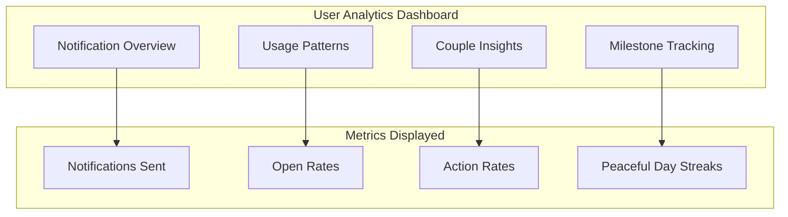
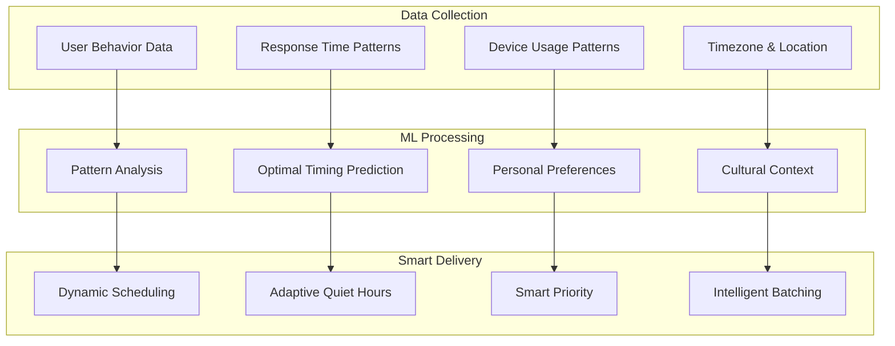
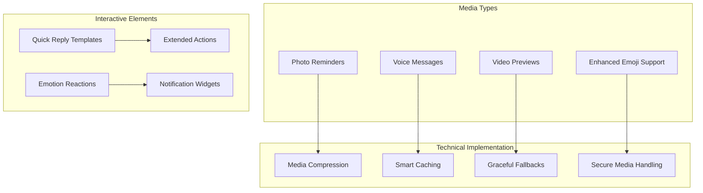
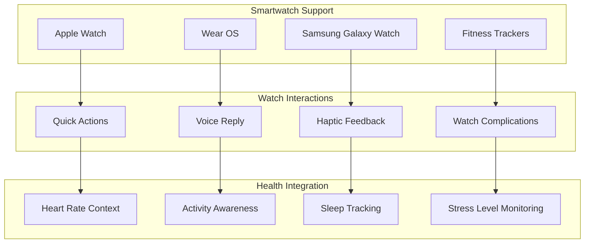
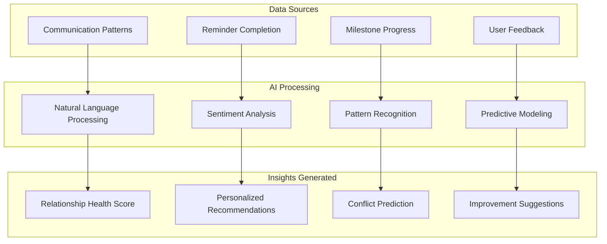
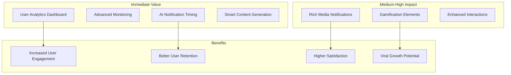
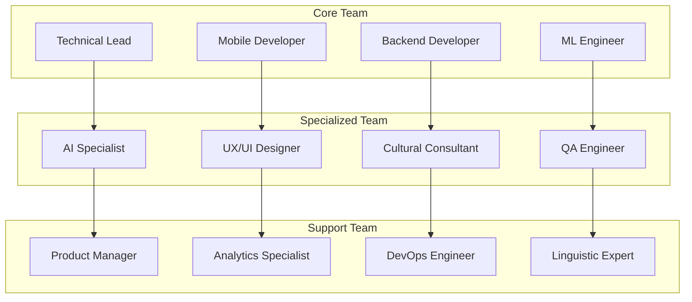

# Mobile Notifications: Next Steps & Future Enhancements

## 🚀 Phase 4: Advanced Features & Optimization Roadmap

### Overview
With the successful completion of Phases 1-3, the ILoveYou mobile notifications system is production-ready. Phase 4 focuses on advanced features, optimization, and expanding the notification ecosystem to provide even richer user experiences.

## 📊 Phase 4.1: Analytics & Monitoring Enhancement (Priority: High)

### Implementation Timeline: 2-3 weeks

#### 🎯 Analytics Dashboard for Users
**Objective**: Provide users with insights into their notification usage and relationship patterns.

##### User-Facing Analytics


##### Features to Implement:
- **📈 Personal Statistics**:
  - Weekly/monthly notification summary
  - Most active notification types
  - Response time to reminders
  - Quiet hours effectiveness

- **💕 Couple Analytics**:
  - Shared reminder completion rates
  - Communication patterns
  - Peaceful days trends
  - Milestone achievements timeline

- **🎯 Goal Tracking**:
  - Reminder completion streaks
  - Love message frequency
  - Relationship harmony metrics
  - Personal improvement trends

#### 🔍 Advanced System Monitoring
**Objective**: Implement comprehensive monitoring for proactive issue detection.

##### Technical Monitoring Stack:
```javascript
// Enhanced monitoring implementation
const monitoringStack = {
  realTimeMetrics: {
    notificationDelivery: 'Firebase Performance',
    userEngagement: 'Google Analytics 4',
    errorTracking: 'Firebase Crashlytics',
    performanceAPM: 'Firebase Performance'
  },
  
  alerting: {
    deliveryFailures: 'Cloud Monitoring',
    performanceDegradation: 'Firebase Alerts',
    userDropoff: 'Custom Alerts',
    securityEvents: 'Cloud Security Command Center'
  },
  
  businessIntelligence: {
    userBehavior: 'BigQuery',
    cohortAnalysis: 'Firebase Analytics',
    culturalInsights: 'Custom Dashboards',
    marketAdoption: 'Vietnamese Market Analytics'
  }
};
```

##### Implementation Plan:
1. **Week 1**: Firebase Analytics integration and custom event tracking
2. **Week 2**: BigQuery data pipeline and dashboard creation
3. **Week 3**: Advanced alerting and automated reporting

## 🤖 Phase 4.2: AI-Powered Smart Features (Priority: Medium-High)

### Implementation Timeline: 4-6 weeks

#### 🧠 Intelligent Notification Timing
**Objective**: Use machine learning to optimize notification timing for each user.

##### Smart Scheduling Algorithm:


##### Features to Implement:
- **📱 Usage Pattern Learning**:
  - Device usage time analysis
  - Response time pattern recognition
  - Optimal engagement window detection
  - Distraction-free period identification

- **🎯 Personalized Timing**:
  - Individual optimal notification times
  - Couple coordination optimization
  - Cultural event awareness (Vietnamese holidays)
  - Work schedule adaptation

- **🔄 Adaptive Algorithms**:
  - Continuous learning from user interactions
  - Seasonal pattern adjustment
  - Relationship milestone timing
  - Stress-free delivery optimization

#### 💬 Smart Content Generation
**Objective**: AI-assisted romantic content generation for Vietnamese couples.

##### Content Enhancement Features:
```typescript
interface SmartContentFeatures {
  romanticSuggestions: {
    loveMessageTemplates: string[];
    reminderTitles: string[];
    milestoneMessages: string[];
    culturallyAppropriate: boolean;
  };
  
  personalization: {
    coupleSpecificLanguage: string[];
    relationshipStageAdaptation: string;
    personalityBasedTone: string;
    memoryIntegration: string[];
  };
  
  contextAwareness: {
    seasonalContent: string[];
    holidaySpecificMessages: string[];
    timeOfDayOptimization: string;
    moodBasedSuggestions: string[];
  };
}
```

##### Implementation Approach:
1. **Vietnamese Language Model**: Train on romantic Vietnamese content
2. **Cultural Context Engine**: Incorporate Vietnamese relationship customs
3. **Personalization Layer**: Learn couple-specific communication patterns
4. **Quality Assurance**: Human review for cultural appropriateness

## 📱 Phase 4.3: Rich Media & Advanced Interactions (Priority: Medium)

### Implementation Timeline: 3-4 weeks

#### 🖼️ Rich Media Notifications
**Objective**: Enhance notifications with images, voice, and interactive content.

##### Media Enhancement Features:


##### Features to Implement:
- **📸 Photo Integration**:
  - Photo reminders with embedded images
  - Memory-based notifications with couple photos
  - Achievement notifications with celebration images
  - Culturally relevant Vietnamese imagery

- **🎤 Voice Messages**:
  - Voice reminder recording and playback
  - Voice message notifications with waveform preview
  - AI-generated voice summaries
  - Vietnamese text-to-speech integration

- **⚡ Enhanced Interactions**:
  - Swipe actions for quick responses
  - Long-press for additional options
  - Inline reply with smart suggestions
  - Emotion reactions (heart, laugh, surprise, etc.)

#### 🎮 Gamification Elements
**Objective**: Introduce game-like elements to increase engagement.

##### Gamification Features:
```javascript
const gamificationElements = {
  achievements: {
    notificationStreak: 'Respond to 7 days of notifications',
    peacefulMilestones: 'Achieve 30, 60, 100 peaceful days',
    loveMessageMaster: 'Send 50 love messages',
    reminderChampion: 'Complete 100 reminders on time'
  },
  
  rewards: {
    unlockableThemes: 'Romantic notification themes',
    customSounds: 'Vietnamese love song notification sounds',
    specialBadges: 'Couple achievement badges',
    anniversaryContent: 'Special anniversary notification styles'
  },
  
  socialFeatures: {
    coupleLeaderboard: 'Compare with other couples (anonymous)',
    milestoneSharing: 'Share achievements with friends',
    challengeSystem: 'Monthly relationship challenges',
    communityEvents: 'Vietnamese holiday celebrations'
  }
};
```

## ⌚ Phase 4.4: Wearable & Multi-Device Support (Priority: Medium)

### Implementation Timeline: 5-7 weeks

#### ⌚ Smartwatch Integration
**Objective**: Extend notifications to Apple Watch and Android Wear devices.

##### Wearable Features:


##### Implementation Features:
- **⌚ Native Watch Apps**:
  - Standalone watch app for basic functions
  - Offline reminder management
  - Quick couple communication
  - Peaceful days counter on watch face

- **🔔 Enhanced Watch Notifications**:
  - Custom haptic patterns for different notification types
  - Voice reply with Vietnamese language support
  - Quick action buttons optimized for small screens
  - Couple-specific notification grouping

- **💓 Health Context Integration**:
  - Stress-aware notification timing
  - Activity-based delivery optimization
  - Sleep pattern respect
  - Heart rate-based emotional context

#### 📱 Multi-Device Synchronization
**Objective**: Seamless experience across all user devices.

##### Cross-Device Features:
```typescript
interface MultiDeviceSync {
  deviceManagement: {
    deviceRegistration: Device[];
    primaryDeviceSelection: Device;
    notificationRouting: NotificationRoute[];
    crossDeviceActions: Action[];
  };
  
  smartDelivery: {
    activeDeviceDetection: boolean;
    intelligentRouting: boolean;
    duplicatePreventaion: boolean;
    continuityHandoff: boolean;
  };
  
  userExperience: {
    seamlessSignin: boolean;
    sharedPreferences: boolean;
    crossDeviceHistory: boolean;
    unifiedInterface: boolean;
  };
}
```

## 🌐 Phase 4.5: Global Expansion Features (Priority: Low-Medium)

### Implementation Timeline: 6-8 weeks

#### 🌍 Multi-Language Support Expansion
**Objective**: Expand beyond Vietnamese to support international couples.

##### Language Expansion Plan:
1. **Asian Languages** (Priority 1):
   - **Thai**: Large Vietnamese diaspora community
   - **Korean**: Popular culture influence in Vietnam
   - **Japanese**: Technology-forward market
   - **Chinese (Simplified)**: Regional proximity

2. **Western Languages** (Priority 2):
   - **French**: Historical Vietnam connection
   - **German**: Large Vietnamese community
   - **Spanish**: Global reach
   - **Portuguese**: Brazilian Vietnamese community

##### Cultural Adaptation Framework:
```javascript
const culturalAdaptation = {
  languageFeatures: {
    romanticExpressions: 'Culture-specific romantic language',
    formalityLevels: 'Appropriate formality for relationships',
    culturalReferences: 'Local customs and traditions',
    holidayIntegration: 'National and cultural holidays'
  },
  
  relationshipNorms: {
    communicationStyles: 'Direct vs indirect communication',
    milestoneDefinitions: 'Culture-specific relationship milestones',
    privacyExpectations: 'Cultural privacy norms',
    familyIntegration: 'Extended family involvement'
  },
  
  technicalLocalization: {
    dateTimeFormats: 'Local date and time formats',
    numberFormats: 'Local number and currency formats',
    addressFormats: 'Local address formats',
    phoneFormats: 'Local phone number formats'
  }
};
```

#### 🕒 Timezone Intelligence Enhancement
**Objective**: Advanced timezone and cultural calendar support.

##### Advanced Timezone Features:
- **🌍 Global Timezone Support**: Automatic detection and handling
- **✈️ Travel Adaptation**: Temporary timezone changes for travel
- **📅 Cultural Calendars**: Lunar calendar support for Asian holidays
- **🏢 Work Schedule Integration**: Global work culture awareness

## 🔮 Phase 4.6: Advanced AI & Machine Learning (Priority: Future)

### Implementation Timeline: 8-12 weeks

#### 🧠 Relationship Intelligence Engine
**Objective**: AI-powered relationship insights and recommendations.

##### AI-Powered Features:


##### Advanced AI Features:
- **💕 Relationship Health Analytics**:
  - Communication quality analysis
  - Conflict prediction and prevention
  - Harmony trend analysis
  - Personalized improvement recommendations

- **🎯 Proactive Suggestions**:
  - Date idea recommendations
  - Gift suggestions based on preferences
  - Communication improvement tips
  - Relationship milestone planning

- **🔮 Predictive Notifications**:
  - Stress period prediction and support
  - Anniversary and special date reminders
  - Optimal communication timing
  - Relationship maintenance suggestions

## 📈 Implementation Prioritization Matrix

### High Priority (Phase 4.1-4.2)


### Medium Priority (Phase 4.3-4.4)
- **Rich Media & Interactions**: Enhanced user experience
- **Wearable Support**: Broader device ecosystem
- **Multi-Device Sync**: Seamless experience
- **Advanced Personalization**: Deeper user engagement

### Lower Priority (Phase 4.5-4.6)
- **Global Expansion**: Market expansion opportunity
- **Advanced AI**: Future competitive advantage
- **Relationship Intelligence**: Premium feature potential

## 🎯 Success Metrics for Phase 4

### User Engagement Metrics
- **📊 Analytics Usage**: >60% users view their notification analytics monthly
- **🤖 AI Feature Adoption**: >70% users enable smart timing features
- **📱 Multi-Device Usage**: >40% users connect multiple devices
- **⌚ Wearable Adoption**: >25% users with compatible devices use watch features

### Technical Performance Metrics
- **🚀 AI Response Time**: <2 seconds for smart recommendations
- **📊 Analytics Loading**: <1 second for dashboard data
- **🔄 Cross-Device Sync**: <5 seconds synchronization time
- **📱 Rich Media Loading**: <3 seconds for image notifications

### Business Impact Metrics
- **💰 User Retention**: +15% improvement in 6-month retention
- **📈 Engagement**: +25% increase in daily active usage
- **⭐ Satisfaction**: 4.7+ app store rating maintenance
- **🌍 Market Expansion**: Successful launch in 2+ new language markets

## 🛠️ Development Resources Required

### Team Structure for Phase 4


### Technology Stack Additions
```javascript
const phase4TechStack = {
  aiAndMl: {
    modelFramework: 'TensorFlow.js / Firebase ML',
    languageProcessing: 'Google Cloud Natural Language API',
    personalizedModels: 'Firebase ML Custom Models',
    edgeComputing: 'TensorFlow Lite'
  },
  
  analytics: {
    dataWarehouse: 'Google BigQuery',
    realTimeAnalytics: 'Firebase Analytics',
    businessIntelligence: 'Google Data Studio',
    customDashboards: 'React Dashboard Framework'
  },
  
  mediaProcessing: {
    imageOptimization: 'Cloudinary / Firebase Storage',
    voiceProcessing: 'Google Cloud Speech-to-Text',
    videoProcessing: 'Firebase Storage + FFmpeg',
    compressionServices: 'WebP / AVIF support'
  },
  
  wearableIntegration: {
    appleWatch: 'WatchOS SDK',
    wearOS: 'Wear OS SDK',
    crossPlatform: 'React Native Wear',
    healthKit: 'HealthKit / Google Fit integration'
  }
};
```

## 📅 Implementation Timeline

### Months 1-2: Foundation (Phase 4.1)
- **Week 1-2**: Analytics dashboard development
- **Week 3-4**: Advanced monitoring implementation
- **Week 5-6**: User testing and refinement
- **Week 7-8**: Production deployment and monitoring

### Months 3-4: Intelligence (Phase 4.2)
- **Week 9-10**: AI timing algorithm development
- **Week 11-12**: Smart content generation system
- **Week 13-14**: Machine learning model training
- **Week 15-16**: A/B testing and optimization

### Months 5-6: Rich Experience (Phase 4.3)
- **Week 17-18**: Rich media notification system
- **Week 19-20**: Enhanced interaction development
- **Week 21-22**: Gamification feature implementation
- **Week 23-24**: User experience optimization

### Months 7-8: Multi-Device (Phase 4.4)
- **Week 25-26**: Wearable integration development
- **Week 27-28**: Multi-device synchronization
- **Week 29-30**: Cross-platform testing
- **Week 31-32**: Performance optimization

## 🎊 Long-Term Vision (12+ Months)

### Revolutionary Features
- **🧠 AI Relationship Counselor**: AI-powered relationship advice
- **🌍 Global Couple Community**: Anonymous couple community features
- **🎨 AR/VR Integration**: Augmented reality notification experiences
- **🏠 IoT Integration**: Smart home integration for ambient notifications
- **🔮 Predictive Relationships**: Advanced relationship outcome prediction

### Market Leadership Goals
- **🥇 #1 Couple App**: Leading couple communication app in Vietnam
- **🌏 Regional Expansion**: Top 3 in Southeast Asian markets
- **🏆 Innovation Leader**: Pioneer in AI-powered relationship technology
- **🌟 Cultural Bridge**: Model for culturally-sensitive app localization

---

## 🎯 Conclusion

Phase 4 represents an ambitious but achievable roadmap that will transform ILoveYou from a well-functioning couple app into an industry-leading, AI-powered relationship platform. The phased approach ensures:

- **📈 Continuous Value Delivery**: Each phase provides immediate user value
- **🔬 Iterative Learning**: Feedback-driven development and optimization
- **🌱 Scalable Growth**: Features that support rapid user base expansion
- **🚀 Innovation Leadership**: Cutting-edge features that differentiate from competitors

The success of this roadmap will establish ILoveYou as the premier relationship technology platform for Vietnamese couples and provide a strong foundation for global expansion.

---

*Next Steps Document Version: 1.0*  
*Planning Date: June 9, 2025*  
*Timeline: 8-12 months for full Phase 4 implementation*  
*Vision: Revolutionary relationship technology platform*