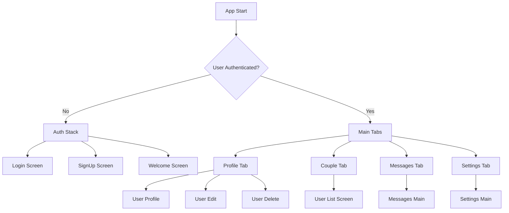
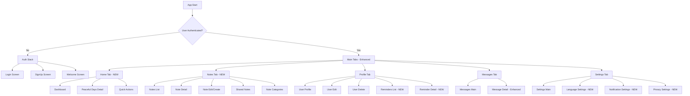

# Navigation Architecture & Screen Structure

## Current Navigation Structure

### Existing Navigation Flow


### Current Tab Structure
```javascript
// Existing bottom tab navigation
<Tab.Navigator>
  <Tab.Screen name="Profile" component={UserStack} />
  <Tab.Screen name="Couple" component={UserListScreen} />
  <Tab.Screen name="Messages" component={MessagesStack} />
  <Tab.Screen name="Settings" component={SettingsStack} />
</Tab.Navigator>
```

## Enhanced Navigation Architecture

### New Navigation Structure


### Enhanced Tab Configuration
```javascript
// New bottom tab navigation with 5 tabs
<Tab.Navigator>
  <Tab.Screen 
    name="Home" 
    component={HomeStack} 
    options={{
      tabBarLabel: "Home",
      tabBarIcon: ({ focused }) => (
        <Ionicons name={focused ? "home" : "home-outline"} />
      )
    }}
  />
  <Tab.Screen 
    name="Notes" 
    component={NotesStack} 
    options={{
      tabBarLabel: "Notes",
      tabBarIcon: ({ focused }) => (
        <Ionicons name={focused ? "document-text" : "document-text-outline"} />
      )
    }}
  />
  <Tab.Screen 
    name="Profile" 
    component={ProfileStack} 
    options={{
      tabBarLabel: "Profile", 
      tabBarIcon: ({ focused }) => (
        <Ionicons name={focused ? "person" : "person-outline"} />
      )
    }}
  />
  <Tab.Screen 
    name="Messages" 
    component={MessagesStack}
    options={{
      tabBarLabel: "Messages",
      tabBarIcon: ({ focused }) => (
        <Ionicons name={focused ? "chatbubbles" : "chatbubbles-outline"} />
      )
    }}
  />
  <Tab.Screen 
    name="Settings" 
    component={SettingsStack}
    options={{
      tabBarLabel: "Settings",
      tabBarIcon: ({ focused }) => (
        <Ionicons name={focused ? "settings" : "settings-outline"} />
      )
    }}
  />
</Tab.Navigator>
```

## New Screen Definitions

### Home Stack Navigator
```javascript
const HomeStack = () => (
  <Stack.Navigator
    screenOptions={{
      headerStyle: {
        backgroundColor: "#F8BBD9",
        shadowColor: "#E91E63",
      },
      headerTintColor: "#C2185B",
      cardStyle: { backgroundColor: "transparent" },
    }}
  >
    <Stack.Screen
      name="Dashboard"
      component={DashboardScreen}
      options={{ 
        title: "Our Love Dashboard",
        headerShown: false  // Custom header in component
      }}
    />
    <Stack.Screen
      name="PeacefulDaysDetail"
      component={PeacefulDaysDetailScreen}
      options={{ title: "Peaceful Days Journey" }}
    />
    <Stack.Screen
      name="QuickActions"
      component={QuickActionsScreen}
      options={{ title: "Quick Love Actions" }}
    />
  </Stack.Navigator>
);
```

### Notes Stack Navigator
```javascript
const NotesStack = () => (
  <Stack.Navigator
    screenOptions={{
      headerStyle: {
        backgroundColor: "#FFE0F0",
        shadowColor: "#E91E63",
      },
      headerTintColor: "#C2185B",
      cardStyle: { backgroundColor: "transparent" },
    }}
  >
    <Stack.Screen
      name="NotesList"
      component={NotesListScreen}
      options={{ 
        title: "Our Notes",
        headerShown: false  // Custom header with search
      }}
    />
    <Stack.Screen
      name="NoteDetail"
      component={NoteDetailScreen}
      options={({ route }) => ({ 
        title: route.params?.noteTitle || "Note"
      })}
    />
    <Stack.Screen
      name="NoteEdit"
      component={NoteEditScreen}
      options={({ route }) => ({ 
        title: route.params?.isEditing ? "Edit Note" : "New Note"
      })}
    />
    <Stack.Screen
      name="SharedNotes"
      component={SharedNotesScreen}
      options={{ title: "Our Shared Notes" }}
    />
    <Stack.Screen
      name="NoteCategories"
      component={NoteCategoriesScreen}
      options={{ title: "Note Categories" }}
    />
  </Stack.Navigator>
);
```

### Enhanced Profile Stack
```javascript
const ProfileStack = () => (
  <Stack.Navigator
    screenOptions={{
      headerStyle: {
        backgroundColor: "#F8BBD9",
        shadowColor: "#E91E63",
      },
      headerTintColor: "#C2185B",
      cardStyle: { backgroundColor: "transparent" },
    }}
  >
    <Stack.Screen
      name="UserProfile"
      component={UserProfileScreen}
      options={{ title: "My Profile" }}
    />
    <Stack.Screen
      name="UserEdit"
      component={UserEditScreen}
      options={{ title: "Edit Profile" }}
    />
    <Stack.Screen
      name="UserDelete"
      component={UserDeleteScreen}
      options={{ title: "Delete Account" }}
    />
    <Stack.Screen
      name="RemindersList"
      component={RemindersListScreen}
      options={{ title: "My Reminders" }}
    />
    <Stack.Screen
      name="ReminderDetail"
      component={ReminderDetailScreen}
      options={({ route }) => ({ 
        title: route.params?.reminderTitle || "Reminder"
      })}
    />
    <Stack.Screen
      name="ReminderEdit"
      component={ReminderEditScreen}
      options={({ route }) => ({ 
        title: route.params?.isEditing ? "Edit Reminder" : "New Reminder"
      })}
    />
  </Stack.Navigator>
);
```

### Enhanced Settings Stack
```javascript
const SettingsStack = () => (
  <Stack.Navigator
    screenOptions={{
      headerStyle: {
        backgroundColor: "#F8BBD9",
        shadowColor: "#E91E63",
      },
      headerTintColor: "#C2185B",
      cardStyle: { backgroundColor: "transparent" },
    }}
  >
    <Stack.Screen
      name="SettingsMain"
      component={SettingsScreen}
      options={{ title: "Settings" }}
    />
    <Stack.Screen
      name="LanguageSettings"
      component={LanguageSettingsScreen}
      options={{ title: "Language & Region" }}
    />
    <Stack.Screen
      name="NotificationSettings"
      component={NotificationSettingsScreen}
      options={{ title: "Notifications" }}
    />
    <Stack.Screen
      name="PrivacySettings"
      component={PrivacySettingsScreen}
      options={{ title: "Privacy & Security" }}
    />
    <Stack.Screen
      name="CoupleSettings"
      component={CoupleSettingsScreen}
      options={{ title: "Couple Settings" }}
    />
  </Stack.Navigator>
);
```

## New Screen Components

### Dashboard Screen (Home)
```javascript
// src/screens/home/DashboardScreen.js
const DashboardScreen = ({ navigation }) => {
  return (
    <LoveBackground variant="soft">
      <SafeAreaView style={styles.container}>
        <ScrollView>
          {/* Peaceful Days Counter - Prominent Display */}
          <PeacefulDaysCounter />
          
          {/* Quick Stats */}
          <LoveStatsCard />
          
          {/* Recent Activity */}
          <RecentActivityCard />
          
          {/* Quick Actions */}
          <QuickActionsGrid navigation={navigation} />
          
          {/* Upcoming Reminders */}
          <UpcomingRemindersCard navigation={navigation} />
        </ScrollView>
      </SafeAreaView>
    </LoveBackground>
  );
};
```

### Notes List Screen
```javascript
// src/screens/notes/NotesListScreen.js
const NotesListScreen = ({ navigation }) => {
  return (
    <LoveBackground variant="soft">
      <SafeAreaView style={styles.container}>
        {/* Custom Header with Search */}
        <NotesHeader onSearch={handleSearch} />
        
        {/* Category Filter */}
        <CategoryTabs selectedCategory={category} onSelect={setCategory} />
        
        {/* Notes List */}
        <FlatList
          data={filteredNotes}
          renderItem={({ item }) => (
            <NoteCard 
              note={item} 
              onPress={() => navigation.navigate('NoteDetail', { noteId: item.id })}
            />
          )}
          refreshControl={<RefreshControl refreshing={refreshing} onRefresh={onRefresh} />}
        />
        
        {/* Floating Action Button */}
        <FloatingActionButton 
          onPress={() => navigation.navigate('NoteEdit', { isEditing: false })}
        />
      </SafeAreaView>
    </LoveBackground>
  );
};
```

### Reminders List Screen
```javascript
// src/screens/reminders/RemindersListScreen.js
const RemindersListScreen = ({ navigation }) => {
  return (
    <LoveBackground variant="soft">
      <SafeAreaView style={styles.container}>
        {/* Filter Tabs */}
        <ReminderFilterTabs 
          activeFilter={filter} 
          onFilterChange={setFilter} 
        />
        
        {/* Reminders List */}
        <SectionList
          sections={groupedReminders}
          renderItem={({ item }) => (
            <ReminderCard 
              reminder={item}
              onPress={() => navigation.navigate('ReminderDetail', { reminderId: item.id })}
              onToggleComplete={handleToggleComplete}
            />
          )}
          renderSectionHeader={({ section: { title } }) => (
            <Text style={styles.sectionHeader}>{title}</Text>
          )}
        />
        
        {/* Add Reminder Button */}
        <LoveButton
          title="Add New Reminder"
          onPress={() => navigation.navigate('ReminderEdit', { isEditing: false })}
          variant="primary"
          icon="add-outline"
        />
      </SafeAreaView>
    </LoveBackground>
  );
};
```

## Modal Navigation Patterns

### Quick Action Modals
```javascript
// For quick actions that don't need full screen navigation
const QuickNoteModal = ({ isVisible, onClose }) => (
  <Modal
    animationType="slide"
    transparent={true}
    visible={isVisible}
    onRequestClose={onClose}
  >
    <LoveBackground variant="soft">
      <SafeAreaView style={styles.modalContainer}>
        <QuickNoteForm onSave={handleSave} onCancel={onClose} />
      </SafeAreaView>
    </LoveBackground>
  </Modal>
);

const QuickReminderModal = ({ isVisible, onClose }) => (
  <Modal
    animationType="slide"
    transparent={true}
    visible={isVisible}
    onRequestClose={onClose}
  >
    <LoveBackground variant="soft">
      <SafeAreaView style={styles.modalContainer}>
        <QuickReminderForm onSave={handleSave} onCancel={onClose} />
      </SafeAreaView>
    </LoveBackground>
  </Modal>
);
```

## Deep Linking Configuration

### Enhanced Linking Configuration
```javascript
const linking = {
  prefixes: ["iloveyou://"],
  config: {
    screens: {
      Auth: {
        screens: {
          Login: "login",
          SignUp: "signup",
          Welcome: "welcome",
        },
      },
      Main: {
        screens: {
          Home: {
            screens: {
              Dashboard: "home",
              PeacefulDaysDetail: "peaceful-days",
              QuickActions: "quick-actions",
            },
          },
          Notes: {
            screens: {
              NotesList: "notes",
              NoteDetail: "notes/:noteId",
              NoteEdit: "notes/:noteId/edit",
              SharedNotes: "notes/shared",
              NoteCategories: "notes/categories",
            },
          },
          Profile: {
            screens: {
              UserProfile: "profile",
              UserEdit: "profile/edit",
              UserDelete: "profile/delete",
              RemindersList: "reminders",
              ReminderDetail: "reminders/:reminderId",
              ReminderEdit: "reminders/:reminderId/edit",
            },
          },
          Messages: {
            screens: {
              MessagesMain: "messages",
              MessageDetail: "messages/:messageId",
            },
          },
          Settings: {
            screens: {
              SettingsMain: "settings",
              LanguageSettings: "settings/language",
              NotificationSettings: "settings/notifications",
              PrivacySettings: "settings/privacy",
              CoupleSettings: "settings/couple",
            },
          },
        },
      },
    },
  },
};
```

## Navigation State Management

### Global Navigation State
```javascript
// src/context/NavigationContext.js
const NavigationContext = createContext();

export const NavigationProvider = ({ children }) => {
  const [activeTab, setActiveTab] = useState('Home');
  const [navigationHistory, setNavigationHistory] = useState([]);
  
  const navigateWithHistory = (screen, params) => {
    setNavigationHistory(prev => [...prev, { screen, params, timestamp: Date.now() }]);
  };
  
  return (
    <NavigationContext.Provider value={{
      activeTab,
      setActiveTab,
      navigationHistory,
      navigateWithHistory
    }}>
      {children}
    </NavigationContext.Provider>
  );
};
```

### Quick Navigation Actions
```javascript
// src/utils/navigationUtils.js
export const quickNavigationActions = {
  createNote: (navigation, category = 'other') => {
    navigation.navigate('Notes', {
      screen: 'NoteEdit',
      params: { isEditing: false, category }
    });
  },
  
  createReminder: (navigation, type = 'personal') => {
    navigation.navigate('Profile', {
      screen: 'ReminderEdit',
      params: { isEditing: false, type }
    });
  },
  
  viewPeacefulDays: (navigation) => {
    navigation.navigate('Home', {
      screen: 'PeacefulDaysDetail'
    });
  },
  
  switchLanguage: (navigation) => {
    navigation.navigate('Settings', {
      screen: 'LanguageSettings'
    });
  }
};
```

## Tab Bar Customization

### Enhanced Tab Bar Styling
```javascript
const tabBarOptions = {
  activeTintColor: "#E91E63",
  inactiveTintColor: "#F8BBD9",
  style: {
    backgroundColor: "#FFF",
    borderTopColor: "#F8BBD9",
    borderTopWidth: 1,
    paddingBottom: 5,
    paddingTop: 5,
    height: 70, // Increased height for 5 tabs
    shadowColor: "#E91E63",
    shadowOffset: { width: 0, height: -2 },
    shadowOpacity: 0.15,
    shadowRadius: 8,
    elevation: 10,
  },
  labelStyle: {
    fontSize: 11, // Slightly smaller for 5 tabs
    fontWeight: "600",
    marginTop: 2,
  },
  iconStyle: {
    marginBottom: 2,
  },
  tabStyle: {
    paddingVertical: 4,
  }
};
```

This navigation architecture provides a comprehensive, user-friendly structure for all the new features while maintaining the romantic, couple-focused design of the ILoveYou app.